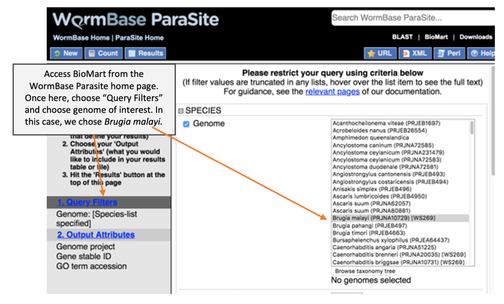
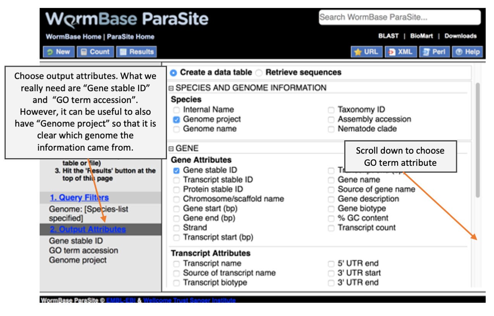
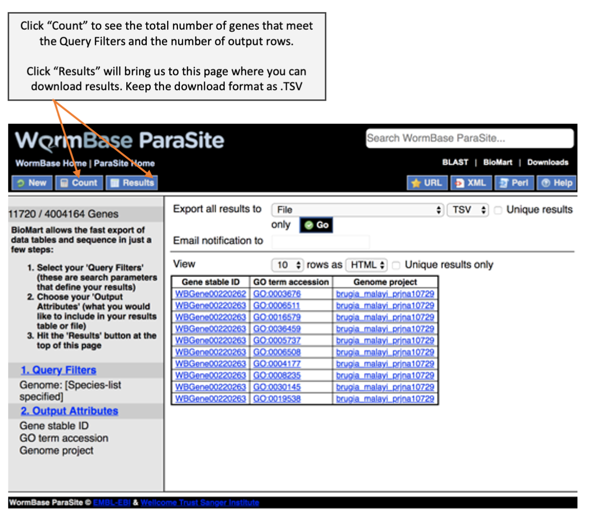
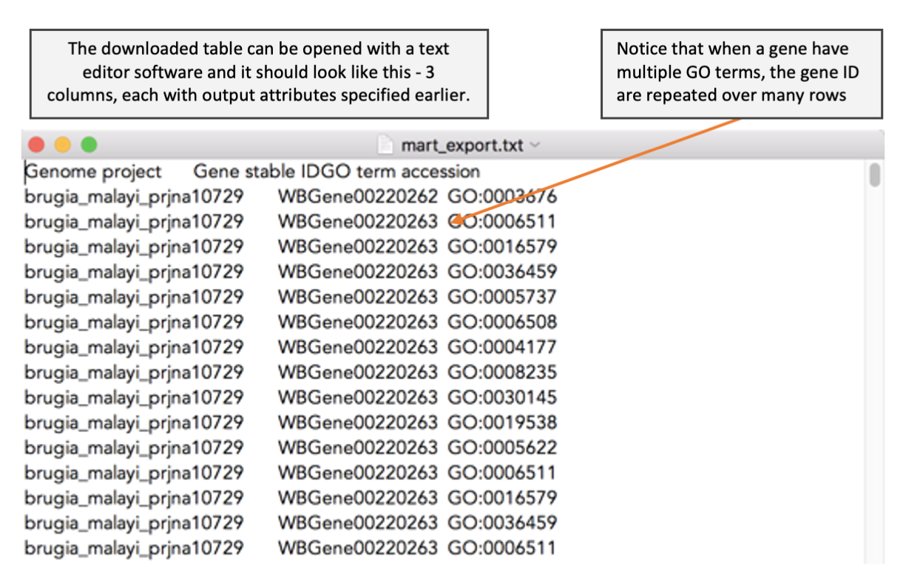
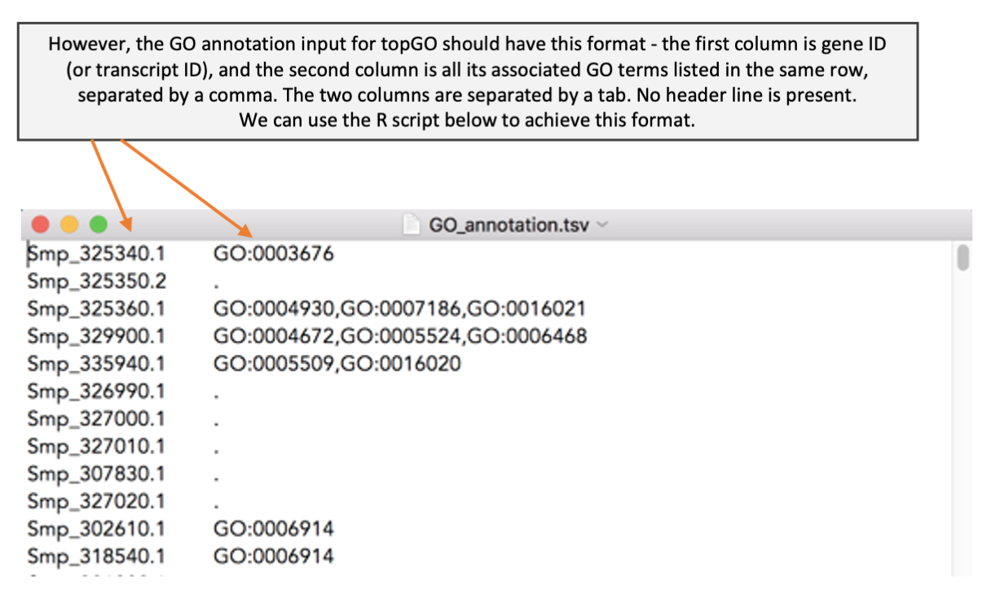

# Downloading and formatting GO annotation

Before we can perform GO term enrichment analysis, we need a reference file that provide a list of GO terms associated for each gene. We have learnt during the WormBase Parasite module that we can download genome-related data from BioMart. Here, we cover more details on how to download GO term annotation from BioMart and how to format the BioMart download to use as an input for topGO. 



---



---



---



---



```R
# Load GO table that we just downloaded from biomart into R
> GOref <- read.delim("~/<path/to/data>/mart_export.txt")
> head(GOref) 
> GOref <- GOref[,-1] # Remove unwanted column


# Prepare a new dataframe 
> GOref2 <- data.frame(matrix(ncol = 2))
> colnames(GOref2) <- c("GeneID","GO")


# Aggregate GO terms from the same gene ID into one row
> for (i in unique(GOref$Gene.stable.ID)) {
GOref2 <- rbind(GOref2,
c(i,paste(GOref$GO.term.accession[which(GOref$Gene.stable.ID == i)], collapse = ",")))
}


# Remove the first row which contain NA
> GOref2 <- GOref2[-1,]


# For genes with no GO term, assign a dot (.) in the GO column
> GOref2[grep("GO", GOref2$GO, fixed = TRUE, invert = TRUE),2] <- "."


# Output the re-formatted GO reference to a file
> write.table(GOref2, file = "GO_annotation_Bmalayi.tsv", quote = FALSE, sep = "\t", col.names = FALSE, row.names = FALSE)
```
The code above is provided to you in the file `GO_formatting.R`
