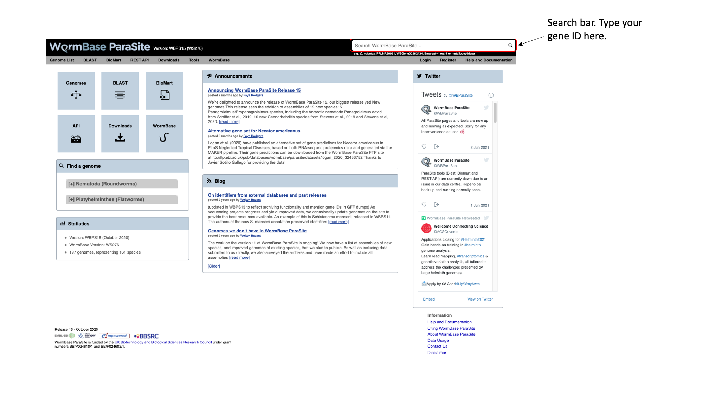
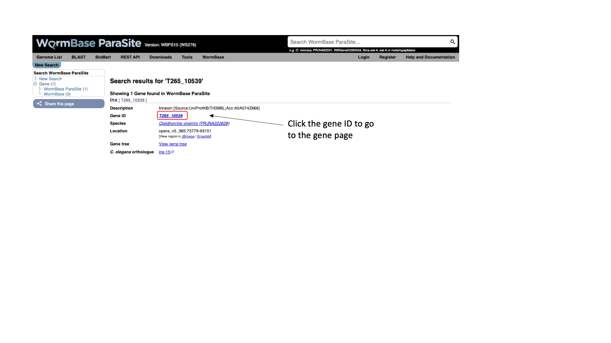
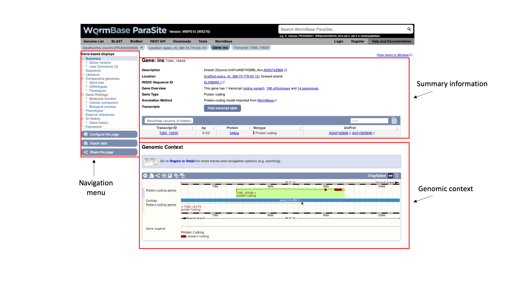
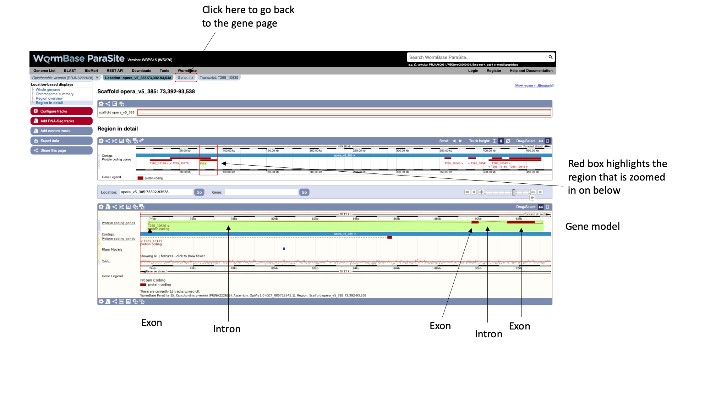
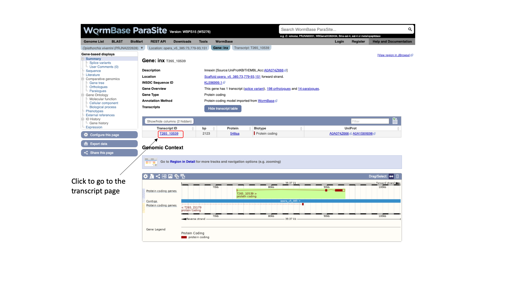
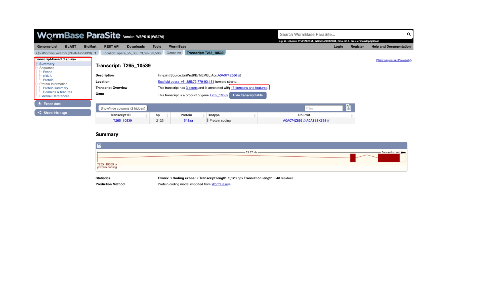
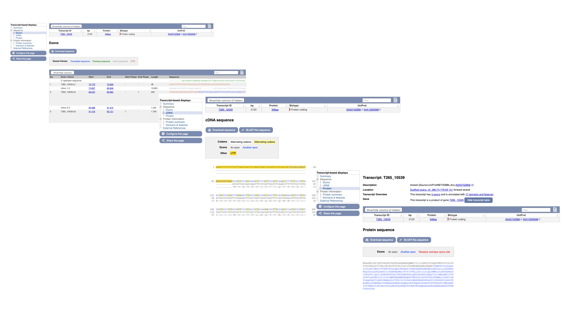
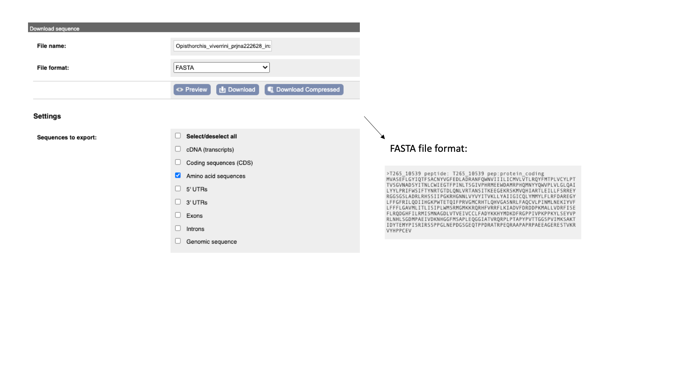
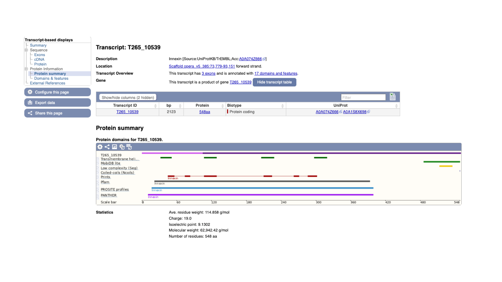

# WormBase ParaSite

## Table of contents
1. [Overview and Aims](#intro)
2. [Genes and genomes](#genes_and_genomes)
3. [Looking at genes in WormBase ParaSite](#wbps_genes)
4. [Looking at genomes in WormBase ParaSite](#wbps_genomes)
5. [BioMart](#biomart)

## Overview and Aims <a name="intro"></a>
WormBase ParaSite is a specialist website that presents data on helminth genomics, gathering together nematode and flatworm genomes that have been assembled and annotated by the research community. Many of the analyses that you did in module 1 can be found pre-computed on WormBase ParaSite, making the data easily accessible in one website. In this module, we’ll demonstrate the different ways that you can interact with WormBase ParaSite data and tools.
We will start by exploring the basic function of the website (part A); go on to examine two ways in which the WormBase ParaSite data can be queried for bulk access (part B); and end by exploring two popular tools in WormBase ParaSite: JBrowse and the Variant Effect Predictor (part C)

## Genes and Genomes  <a name="genes_and_genomes"></a>

## Looking at genes in WormBase ParaSite <a name="wbps_genes"></a>
In this first part of the module we will explore the basic functionality of the WormBase ParaSite website for looking at helminth genes and genomes.

### The Gene Page
The aim of this section is to familiarise you with retrieving information about a gene of interest from WormBase ParaSite. We will use a walk through example to illustrate how to use the website to find out about the function of an Opisthorcis viverrini gene.

#### Basic Navigation
* Open up a web browser, and type this URL into the address bar: https://parasite.wormbase.org/

The page should look something like this:

  

* Paste "T265_10539" into the search bar in the top right of the page and click return. T265_10539 is a gene stable ID.

  

You should get one result returned. Let's look at the T265_10539 gene page.

Every gene in WormBase ParaSite has a gene page, which presents sequence data and a summary of information from various sources about the gene.



The gene page has three main sections. In the summary section, together with the description of our gene we can also see the genomic location of the gene (chromosome 1, in this case) and the INSDC Sequence ID. This is an identifier that links to an entry for the scaffold in the International Nucleotide Sequence Database Collaboration resources (the European Nucleotide Archive, GenBank, and the DNA Databank of Japan). Underneath, we can see some information about the gene: it has 1 transcript isoform and a number of orthologues and paralogues. We’ll revisit this later. We can also see that the gene is protein-coding.

#### Transcript isoforms
```
As covered in module 1, according to the central dogma of molecular biology, eukaryotic genes (DNA) are transcribed to primary transcripts (RNA), which are spliced and capped to form mature transcripts (mRNA) then translated to proteins (polypeptide chains of amino acids). In the 1970s, it was discovered that a single gene can give rise to more than one protein, due to the processes of alternative splicing and alternative translation. When there is evidence for a single gene giving rise to multiple different transcripts in this way, we call the transcripts “isoforms”. The S. ratti example that we have been looking at has 2 transcript isoforms. Here is another example (in C. elegans):

Here, the gene produces two alternative transcripts: one that contains four exons, and one that has skipped the third exon, to produce a shorter mature mRNA. Alternative splicing is a tightly regulated process: different transcripts of a gene might be produced in different tissues, or at different stages of a parasite’s life cycle. It is a process that is common to eukaryotes, allowing organisms to introduce diversity to the complement of proteins that they encode.

```
On the left, we have a navigation menu, which can be used to explore the information that is available for each gene. We’ll be going through each of these menu options in turn.

The “Genomic context” image underneath shows us a snapshot of the scaffold that our gene is on.

* Click the ‘Region in Detail’ link in the “Genomic context” section.


Here, each of the three boxes gives us an increasingly zoomed-in view of the gene’s genomic position. The top box shows us that the gene is located approximately a quarter of the way along the scaffold ("opera_v5_385"). The middle box shows us the local surrounding region of the scaffold. The bottom box shows us the structure of the gene model.

We can see that:

(a) the gene is on the forward strand - you can see this from the ‘>’ symbol located next to the gene name in the protein coding genes track.

(b) the gene has three exons in total, of which 2 contain coding sequence. Both 5' and 3' UTRs (untranslated regions) are annotated.

* Navigate back to the gene page by clicking the "Gene:inx" tab at the top of the page.

As well as gene pages, WormBase ParaSite has a page for each transcript that a gene produces. We have to navigate to the transcript page to see which protein domains have been annotated. 

* On the gene page, click the transcript ID in the transcipt table to navigate to the transcript page.



Again using the navigation menu on the left hand side of the page, we can retrieve three main types of information on the transcript: sequences, information about the protein domains, and external references.



* Click “Exons”, “cDNA” and “Protein” in the “Sequence” section of the navigation menu to see the different types of sequence that are available for the transcript.



The “Exons” tab displays the sequence of individual exons in a table (useful if you’re interested in retrieving, say, only the sequence of exon 2), the “cDNA” tab has the cDNA sequence (the sequence you would get if you reverse transcribed mature mRNA), and the “Protein” tab has the amino acid sequence.
All of the sequences can be downloaded in FASTA format - this is a text format that is widely used for representing sequences, which was introduced in module 1. It consists of a header line (a “>” character and a description or name of the sequence) followed by the sequence itself on the next line. As well as the sequences displayed in the browser, you can also choose to download, for example, genomic sequence, just UTRs etc.



#### Functional annotation: protein domains and GO terms

Section on interproscan.

* Click the “Protein summary” menu option in the navigation menu.


On this page we see a pictorial representation of the protein domains that have been annotated to this polypeptide. For every protein in WormBase ParaSite, we have pre-run InterProScan. We can see here that




