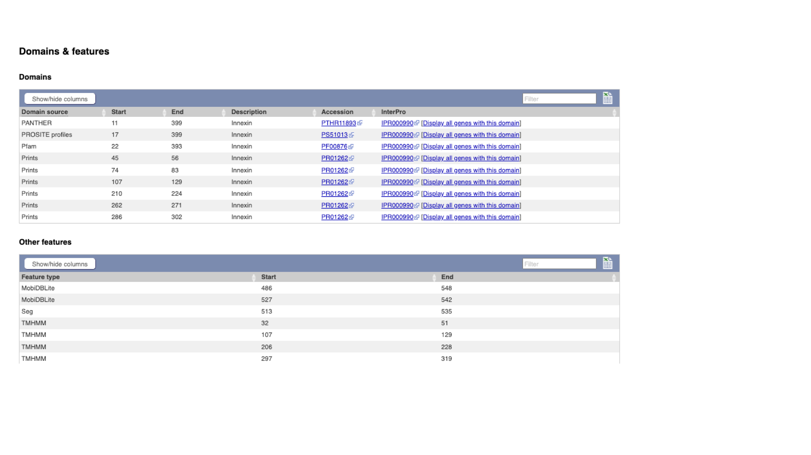
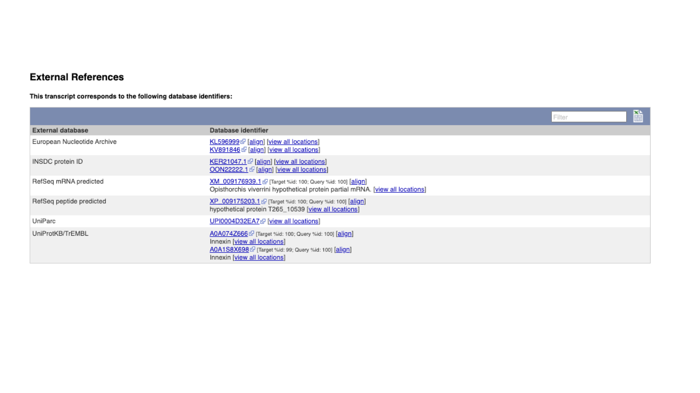
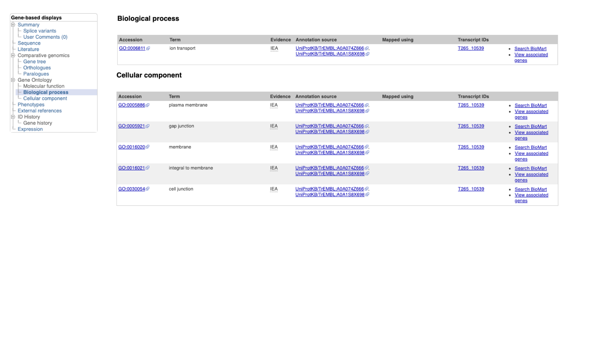
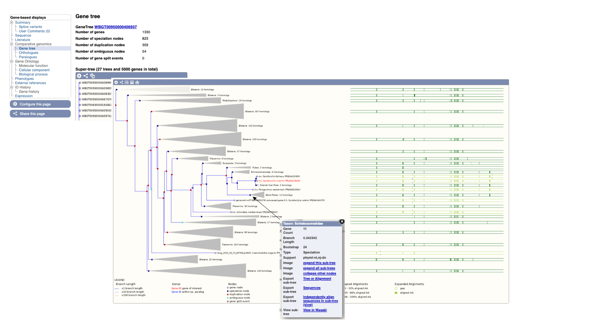
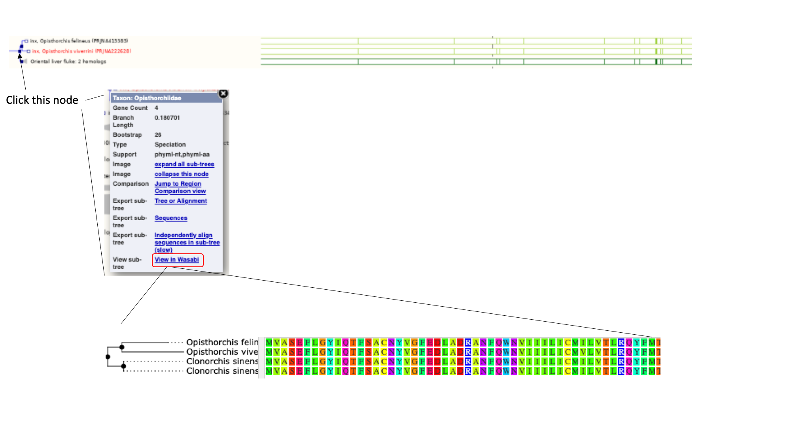
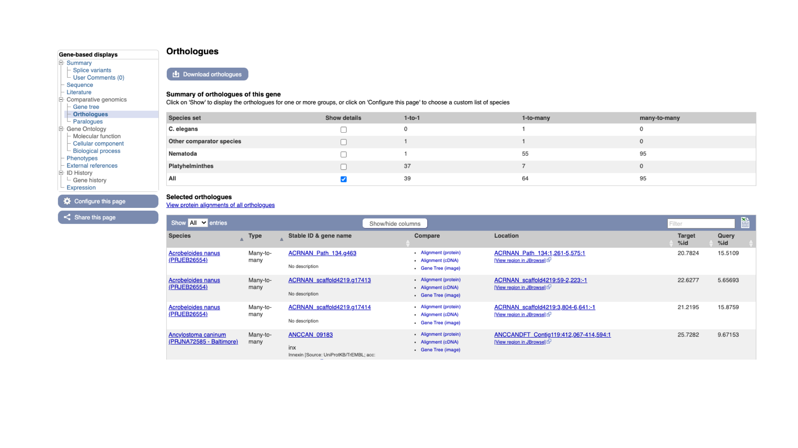

# WormBase ParaSite

## Table of contents
1. [Overview and Aims](#intro)
2. [Genes and genomes](#genes_and_genomes)
3. [Looking at genes in WormBase ParaSite](#wbps_genes)
    * [The gene page](#gene_page)
    * [Functional annotation: protein domains and GO terms](#functional_annotation)
    * [Orthologues and paralogues](#comparative_genomics)
    * EXERCISE (#gene_page_exercise)
4. [Looking at genomes in WormBase ParaSite](#wbps_genomes)
5. [BioMart](#biomart)

## Overview and Aims <a name="intro"></a>
WormBase ParaSite is a specialist website that presents data on helminth genomics, gathering together nematode and flatworm genomes that have been assembled and annotated by the research community. Many of the analyses that you did in module 1 can be found pre-computed on WormBase ParaSite, making the data easily accessible in one website. In this module, we’ll demonstrate the different ways that you can interact with WormBase ParaSite data and tools.
We will start by exploring the basic function of the website (part A); go on to examine two ways in which the WormBase ParaSite data can be queried for bulk access (part B); and end by exploring two popular tools in WormBase ParaSite: JBrowse and the Variant Effect Predictor (part C)

## Genes and Genomes  <a name="genes_and_genomes"></a>

## Looking at genes in WormBase ParaSite <a name="wbps_genes"></a>
In this first part of the module we will explore the basic functionality of the WormBase ParaSite website for looking at helminth genes and genomes.

### The Gene Page <a name="gene_page"></a>
The aim of this section is to familiarise you with retrieving information about a gene of interest from WormBase ParaSite. We will use a walk through example to illustrate how to use the website to find out about the function of an Opisthorcis viverrini gene.

#### Basic Navigation
* Open up a web browser, and type this URL into the address bar: https://parasite.wormbase.org/

The page should look something like this:

  

* Paste "T265_10539" into the search bar in the top right of the page and click return. T265_10539 is a gene stable ID.

  

You should get one result returned. Let's look at the T265_10539 gene page.

Every gene in WormBase ParaSite has a gene page, which presents sequence data and a summary of information from various sources about the gene.


The gene page has three main sections. In the summary section, together with the description of our gene we can also see the genomic location of the gene (chromosome 1, in this case) and the INSDC Sequence ID. This is an identifier that links to an entry for the scaffold in the International Nucleotide Sequence Database Collaboration resources (the European Nucleotide Archive, GenBank, and the DNA Databank of Japan). Underneath, we can see some information about the gene: it has 1 transcript isoform and a number of orthologues and paralogues. We’ll revisit this later. We can also see that the gene is protein-coding.

#### Transcript isoforms
```
As covered in module 1, according to the central dogma of molecular biology, eukaryotic genes (DNA) are transcribed to primary transcripts (RNA), which are spliced and capped to form mature transcripts (mRNA) then translated to proteins (polypeptide chains of amino acids). In the 1970s, it was discovered that a single gene can give rise to more than one protein, due to the processes of alternative splicing and alternative translation. When there is evidence for a single gene giving rise to multiple different transcripts in this way, we call the transcripts “isoforms”. The S. ratti example that we have been looking at has 2 transcript isoforms. Here is another example (in C. elegans):

Here, the gene produces two alternative transcripts: one that contains four exons, and one that has skipped the third exon, to produce a shorter mature mRNA. Alternative splicing is a tightly regulated process: different transcripts of a gene might be produced in different tissues, or at different stages of a parasite’s life cycle. It is a process that is common to eukaryotes, allowing organisms to introduce diversity to the complement of proteins that they encode.

```
On the left, we have a navigation menu, which can be used to explore the information that is available for each gene. We’ll be going through each of these menu options in turn.

The “Genomic context” image underneath shows us a snapshot of the scaffold that our gene is on.

* Click the ‘Region in Detail’ link in the “Genomic context” section.


Here, each of the three boxes gives us an increasingly zoomed-in view of the gene’s genomic position. The top box shows us that the gene is located approximately a quarter of the way along the scaffold ("opera_v5_385"). The middle box shows us the local surrounding region of the scaffold. The bottom box shows us the structure of the gene model.

We can see that:

(a) the gene is on the forward strand - you can see this from the ‘>’ symbol located next to the gene name in the protein coding genes track.

(b) the gene has three exons in total, of which 2 contain coding sequence. Both 5' and 3' UTRs (untranslated regions) are annotated.

* Navigate back to the gene page by clicking the "Gene:inx" tab at the top of the page.

As well as gene pages, WormBase ParaSite has a page for each transcript that a gene produces. We have to navigate to the transcript page to see which protein domains have been annotated. 

* On the gene page, click the transcript ID in the transcipt table to navigate to the transcript page.


Again using the navigation menu on the left hand side of the page, we can retrieve three main types of information on the transcript: sequences, information about the protein domains, and external references.


* Click “Exons”, “cDNA” and “Protein” in the “Sequence” section of the navigation menu to see the different types of sequence that are available for the transcript.


The “Exons” tab displays the sequence of individual exons in a table (useful if you’re interested in retrieving, say, only the sequence of exon 2), the “cDNA” tab has the cDNA sequence (the sequence you would get if you reverse transcribed mature mRNA), and the “Protein” tab has the amino acid sequence.
All of the sequences can be downloaded in FASTA format - this is a text format that is widely used for representing sequences, which was introduced in module 1. It consists of a header line (a “>” character and a description or name of the sequence) followed by the sequence itself on the next line. As well as the sequences displayed in the browser, you can also choose to download, for example, genomic sequence, just UTRs etc.


#### Functional annotation: protein domains and GO terms <a name="functional_annotation"></a>

Section on interproscan.

* Click the “Protein summary” menu option in the navigation menu.


On this page we see a pictorial representation of the protein domains that have been annotated to this polypeptide. For every protein in WormBase ParaSite, we have pre-run InterProScan. We can see here that this protein has a match with an Innexin domain in several protein domain databases, and four transmembrane helices.


The same data is available in tabular format

* Click the “Domains & features” menu option.



Where possible, annotated domains are linked to their entries in the appropriate external database. As you saw in module 1, these often have useful descriptions of what is known about the domain. A good place to start to learn about protein domains is usually the InterPro website: follow the IPR000990 link in the InterPro column to learn more about the biology of protein.

* Click “External References” in the navigation menu.



External references are the identifiers by which the gene (or transcript or protein, in this case) is known in other databases. These usually include RefSeq (the reference sequence database of the NCBI) and UniProt, and sometimes (though not in this case), WormBase ParaSite’s sister database, WormBase.

Another fast way to find out about the function of a gene’s product is to see which Gene Ontology (GO) terms have been associated with it. GO is a project that seeks to describe complex biology in a logical, hierarchical and computer-processable way. It is a controlled vocabulary, whereby proteins are associated with GO terms that describe their function. There are three aspects to GO: Cellular Component, Molecular Function and Biological Process. Cellular Component GO terms describe where a protein is localised (in the membrane, extracellular, in the nucleus etc). Molecular Function GO terms describe the biochemical activity of the protein. Biological Process GO terms describe the pathways and broader processes that the protein contributes to.

* Click the “Gene:inx” tab at the top of the page to return to the main gene page, then select “Cellular component” from the Gene Ontology section of the navigation menu.



WormBase ParaSite imports GO annotations from three sources: terms assigned by UniProt, terms inferred by the protein’s InterPro domains, and terms that have been associated with orthologues of the gene of interest. 

#### Comparative genomics <a name="comparative_genomics"></a>

Another approach to understanding what a gene does is comparative genomics. WormBase ParaSite runs a comparative genomics pipeline, called Compara, that seeks to group all helminth genes, together with comparator genes from a number of model organisms, into families. You can explore the results of the Compara pipeline in a few different ways.

* Select “Gene tree” from the Comparative Genomics section of the navigation menu.



The gene tree shows the inferred evolutionary history of the family that this gene is a member of. At the ends of the branches are genes, with our gene of interest highlighted in red. The points where the branches split are called nodes; nodes represent different evolutionary events, with these being represented in the tree by different colours. Dark blue nodes represent speciation events (where two populations of an existing species diverged into two new species). Red nodes represent duplications, where within the genome of one species the gene was duplicated. Turquoise nodes are ambiguous.

Note that the most closely related genes in the tree are from other Strongyloides species: the animal parasites S. venezuelensis and S. papillosus and the human parasite S. stercoralis. These genes are all orthologues of our gene of interest. Orthologues are genes that evolved from a common ancestral gene by speciation; they may have diverged to a greater or lesser degree in their sequences, but often retain their function in their respective species. Similarly, paralogues are genes that have evolved from a common ancestral gene by duplication (see the information box on the Compara pipeline). They are genes that are found in more than one copy in a species’ genome.

It can be useful to look at alignments of these related proteins to see how well conserved they are. Highly conserved regions are more likely to be essential for the function of the protein.

* Click on the section of the tree labelled “Blood flukes and click “expand this subtree”.

Next to the main tree, in green, we can see a pictorial summary of the multiple alignment of the proteins of these four genes, with green coloured regions representing alignments and non-coloured regions representing gaps. You may be interested in exploring these alignments at a higher resolution.

* Click the node that separates the Opisthorchis from the oriental liver fluke, then click "View in Wasabi" in the pop up box.

A multiple alignment of the four proteins will appear in a new window: we can see that these protein sequences are extremely well conserved. 



Orthologues and paralogues are also available in tabular format, where they can be easily exported.

* Select “Orthologues” in the navigation menu.



In the main table on this page, each row represents an orthologue of *inx*. The table gives details on the nature of the relationship between our *O. viverrini* gene and the gene in the other species, such as whether the gene has one or multiple orthologues in the other species (1-to-1 or 1-to-many), and how similar the two proteins are. Multiple alignments can be viewed by following the links.

#### Compara: further details

Compara is a pipeline, developed by the Ensembl project, which groups related genes into families and defines the evolutionary relationships between them. Below is a summary of the steps of the pipeline:
1. A library of protein family Hidden Markov Models (HMMs) is used as a starting point. Gene sequences are scored against these models, giving a probability of how likely each sequence is to be a member of the corresponding family. The HMM library used in the Compara pipeline is based on the Panther and TreeFam databases.
2. Any proteins that were not classified into a family in the HMM search are then compared with each other by all-against-all BLAST.
3. Any family with more than 400 members is broken down into smaller families (max 400 proteins).
4. All of the protein sequences in each family are aligned against each other using efficient multiple alignment software.
5. For each family, a phylogenetic tree is built (using TreeBeST5). Tree building is guided by a species phylogenetic tree.
6. Orthologues and paralogues are called on the basis of the resulting tree: any two genes separated by speciation events are orthologs, and any two genes in the same species separated by a duplication event are paralogues.

#### Gene page exercise <a name="gene_page_exercise"></a>

The aim of this exercise is to familiarise yourself with the WormBase ParaSite gene page.
Go to the gene page for the Trichuris muris gene TMUE_2000008757 and retrieve the following information:
1. What is the summary description of the gene? Do you have any idea what the gene might be doing from this description?
2. How many transcripts of the gene are annotated?
3. Which strand is the gene on? What is the name of the 5’ neighbouring gene?
4. Download the 3’UTR sequence.
5. What identifier would you use to search for the gene in Uniprot?
6. Where is this gene’s protein predicted to localise to?
7. Which Pfam domains is the protein predicted to have? Which of these is responsible for its DNA binding activity?
8. Download the protein alignment of TMUE_2000008757 and its C elegans orthologue. Is there any published literature on the C elegans orthologue? (Hint: follow the link to the WormBase ParaSite page for the C elegans orthologue and look in the “Literature” tab).


