# WormBase ParaSite (part 2)

## Table of contents
1. [Overview and Aims](#aims)
2. [Tools](#tools)
    * [BLAST](#blast)
      * [EXERCISE](#blast_exercise)
    * [The genome browser](#genome_browser)
    * [Expression data](#expression_data)
      * [EXERCISE](#expression_exercise)
    * [VEP](#vep)
      * [EXERCISE](#vep_exercise)
3. [Accessing WormBase ParaSite data programmatically](#programmatic_access)
    * [Working with sequence and annotation files](#files)
    * [The REST API](#api)

## Overview and Aims <a name="aims"></a>

In this module, we return to WormBase ParaSite. We'll start by looking at four commonly-used tool/ data sets: BLAST, JBrowse (a genome browser), expression data, and the variant effect predictor (VEP). In the second section, we'll apply some of the command line skills that you were introduced to in module 2 to explore WormBase ParaSite data programmatically.

## Tools <a name="tools"></a>

In this section, we'll look at more ways that you can interact with WormBase ParaSite data. 

### BLAST <a name="blast"></a>

BLAST (Basic Local Alignment Search Tool) is one of the most commonly used tools to search for sequences that are similar to each other. BLAST is a fast searching programme that is able to compare a query sequence with hundreds to millions of sequences quickly. You can use BLAST to search a query sequence against the sequences in WormBase ParaSite.

BLAST uses three steps. First, it 'chops' the query sequence into small 'words' of typically 3-4 amino acids for proteins or 10-12 nucleotides for DNA sequences (Figure A). Second, it uses these short words to look for perfect matches across all the entries in the database (Figure B). Third, when a match is found it then tries to extend the alignment by comparing consecutive letters of the word. For each new pair of letters, it evaluates whether it is a good match (Figure C). If it is a good match then the score is increased and if it is a bad match the score is reduced. The score table for each pair of amino acids or nucleotides is precomputed and incorporated into the BLAST algorithm.

The extension step will continue until the overall score drops below a given value. At this point, the extension step is dropped and the alignment is recorded with its score. The results are then presented as a list of alignments with associated scores. The alignments with the highest scores are most likely to be true matches or homologues of the query sequence. Other result parameters are reported, such as E-value (expectation value) and the percentage identity. The E-value describes the number of hits that could be found by chance given the length of the sequence and the size of the database. The lower the E-value, the greater the chances that the result is not due to chance.

There are different flavours of the BLAST programme depending on whether the query is a nucleotide or a protein sequence and also depending on the nature (nucleotide or protein) of the database we are searching in. If the query is a nucleotide sequence and we are searching for matches in a nucleotide database, the program to use is BLASTn. Similarly, if the query is a protein sequence and we are looking for matches in a protein database, the programme to use is BLASTp.

But what should you do when the query and the database are different? For example, if you want to query a protein sequence to find the best matches in a nucleotide database? In order to make an alignment, query and subject need to be of the same nature. Helpfully, BLAST can translate all the entries in the nucleotide database into protein sequences - each sequence can be translated into the 6 possible frames! You can then use the resulting "translated database" as the subject for the search. This flavour of BLAST is called tBLASTn. In the reverse scenario, when a nucleotide sequence is the query and you want to search a protein database. The query is translated into the 6 possible frames and is then aligned to the query. This is called BLASTx.

[↥ **Back to top**](#top)

### BLAST exercise <a name="blast_exercise"></a>

Use WormBase ParaSite BLAST to find out the identity of this gene, and which species it belongs to. Does it have any close hits in other genomes?

```
TTTGCAGATGCTTCTCCCTTCAAACTTGACGACGTCAACATTAATGACGTCATCATCAGA
ATCGTACGACGCTGATAATCCGGGGCTTCCGCCTGAGCCAATCCTGTCGGATTACGTGGA
AATGTTCACTTTGGTGCTCAATTTTATTGTTGGCGCGCCGTTGAACCTGGCCGCTTATAC
ACAGCTAAGCGAACGACCTACATCAACGCGGTTAGACCTTCTGAAGCGATCACTCAACTA
TTCGGATCTTCTCGTTCTATTCATCTACGTACCATCTCGTGCCTGCTGGTTATTGACCTA
CGATTGGCGGGGTGGAGATGCACTCTGTAAAATTGTCAAGATGTTTCATACGTTCGCGTT
TCAGAGCTCCTCCAACGTGATCGTGTGCATCGCCGTGGATCGCCTGCTATCCGTCCTCTC
CCCATCCCATCACAGCCCCAACAAAGCCCTGAAACGGACTAAAATGATGTTAATAGTCGC
GTGGATAGTAGCGCTAGTAATCTCATGCCCACAACTTTTCATCTGGAAAGCATATCTAGC
ACTTCCCGAGTATAATTGGAGCCAGTGTCTGCAAATTTGGGAGATTGCACGGATGGAAAA
ATTCAACAAACCACAGGTAGTGCCAGAGTTTGACGCCGAGTTCTGGTACAGCATACTGCA
TATTAGTCTCGTTTTTTGGATCCCTTGTATCATTATCATGCTATCCTACATCATAGTCAT
CTCATGGGTATGGATCAACTCTCGGCCGTCCATCCGTCACACCTCTTCATTTTCCTTCCA
CACCGGCTGCGATACGGTAGATACAGTACTGACTAGAGCCTCTGAATGGAATCCTTTGAA
GACATTCTCCCGTCACGTCAACATCAAGGAGCCCGAGAAGCCGATGACGACTCCCAGAAT
CGTGGTCAGCGACGAGACGGAGGTCCCACTGACGCAGCGACCATCGATTTCTCCGTCGGA
AGCGTCGGCGGTGATGAGGACCGGTGTGCACACGAGTACCTCGTATAATGCTAATTTGAA
TCGATCCCGAGCCCTGCGAGTTTCCTTGCTACTAGTCGTCGCGTACATCATCTGCTGGCT
ACCATATAACCTCATAAGTCTTATCCAATTTCTTGATCGGGACTTTTTTTCGTCATATCT
TAAACATGTCCACTTCTGCCAACAACTAATCATTTTTAACTCGGTCGTCAATCCATGGCT
CTACGGTTTCTTCGGTCCCCGCCGCCCGTCTACCACCGGTGCCGGCCGTCACTGATCTCC
AAACATCAAACATCGAATTCGCCATATCTTTCCAAAATCCCCCCAACGTTCCAGTTTTCA
AGCCCAACGAATTGCCAATGCCATATCTTTAACAACTTTTATGGTTTCTTGTTTGTTTTT
TTTTATTTATTTTATTGTAATGTTTGATTCTCGGTGAAAAATTTGTGTAAAATAAATTAT
TTTTTATGTGAAA
```

[↥ **Back to top**](#top)

### The genome browser <a name="genome_browser"></a>

A genome browser is a tool that allows you to visualise a genome assembly and its features, together with experimental data aligned to the genome. Genome browsers are useful in many respects. For example, they are used for visualising gene models in their genomic context, and also to assess the correctness of the model. They are also used for visualising functional genomics data, such as the results of ChIP-Seq and RNA-Seq experiments.

There are several commonly used genome browsers in bioinformatics, each with different features. Examples include:

* The Integrative Genomics Viewer (IGV) - this software can be downloaded and installed locally to work with local data without internet access.
* The UCSC Genome Browser - this browser hosts selected vertebrate species and some model organism (and closely related) species.
* Ensembl - this can be used to browse a large catalog of genomes across the tree of life. WormBase ParaSite has an instance of the Ensembl browser built in.
* Artemis/ Artemis Comparison Tool (ACT) - similar to IGV, this can also run locally without the internet. It can also be used to edit (i.e. change) gene models (to correct errors). ACT is a tool for visualising synteny (regions of similarity) between sequences.
* JBrowse - this is the genome browser that we’ll be using today. WormBase ParaSite has an instance of JBrowse for every genome that it hosts. The Apollo project is a well known extension of JBrowse, which, like Artemis, can be used to edit gene models.

#### Using JBrowse: basic functionality

In this example we’ll introduce the basic functionality of JBrowse, and demonstrate how to use the various tracks.

* Navigate to the S. mansoni genome page and select the “Genome Browser (JBrowse)” icon.

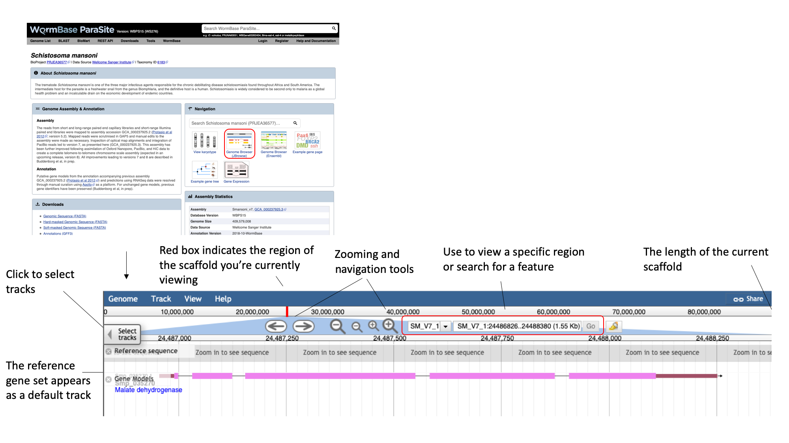

In the genome browser, each scaffold is represented from its 5-prime end to its 3-prime end (relative to the forward strand). You can navigate to different scaffolds using the drop down menu in the middle of the screen, or by typing coordinates into the text box. Different types of data aligned to the genome are represented as tracks. When you first open JBrowse, one track will be on by default: the reference gene set.

For this example, we’ll consider that you’re interested in the gene Smp_312440.

* Start by typing the identifier into the search box and clicking “Go” to navigate to the gene.
* Zoom in by clicking the large magnifying glass with a “+” symbol until the reference sequence resolves.

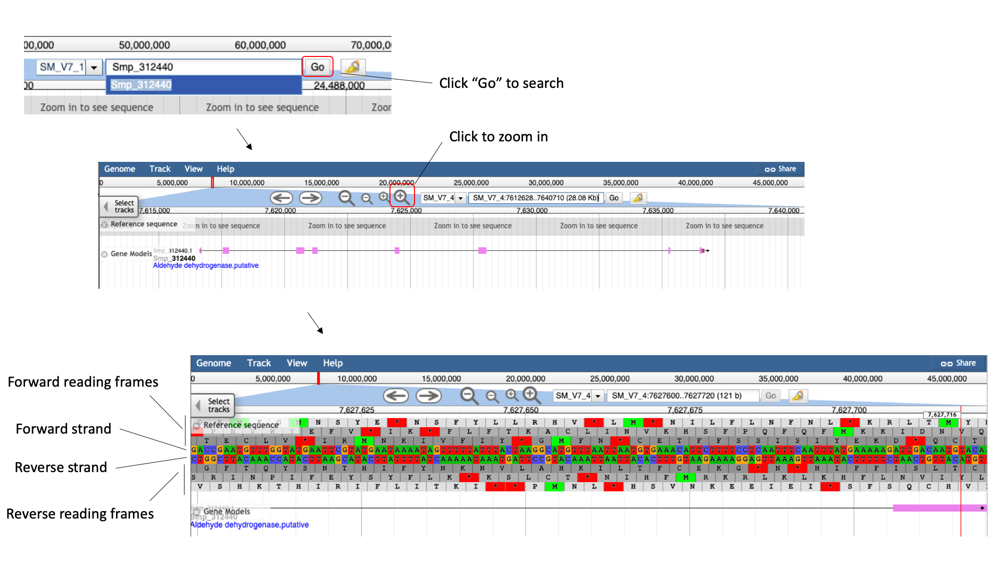

Here, you can see the forward and reverse DNA strands, together with the six possible translational reading frames (3 forward and 3 reverse).

* Zoom out again so that you have the whole gene model in your field of view.
* To extract sequence information about the gene, click the gene model such that a dialogue box pops up.


Scrolling down the content of the box, you can extract genomic or cDNA sequence, or the sequence of specific subfeatures (specific exons or UTRs, for example).

Alternatively, you may wish to extract the genomic sequence of a whole region:

* Click the arrow next to the “Reference sequence” track label in the top left of the screen, select “Save track data”, then download the sequence as a FASTA
file.

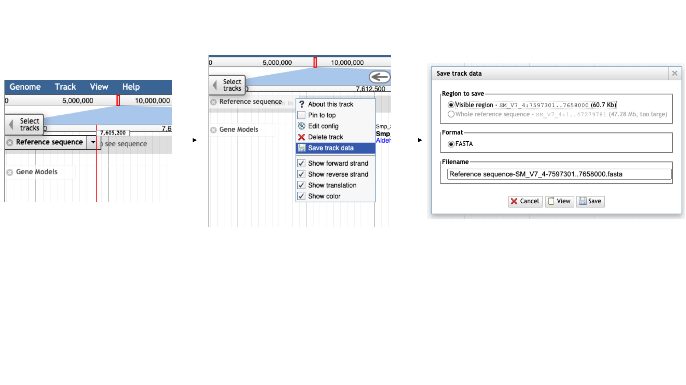

#### Tracks

We can also use JBrowse to view other types of data aligned to the genome. 

* Click the “select tracks” button in the top left of the screen.

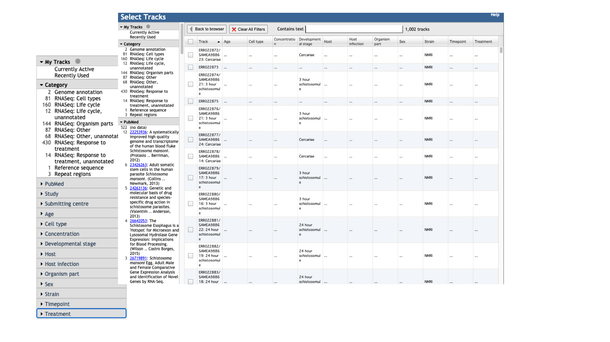

For most species, in addition to the gene model (“Genome Annotation”) track, there are two additional main types of track:

1. Repeat regions tracks - repetitive regions of the genome are annotated as part of WormBase ParaSite’s production process.

2. RNASeq tracks - WormBase ParaSite has a process of finding and aligning RNASeq data in the sequencing archives for our species of interest. These can be useful, for example, for checking that a gene model is well supported by expression data, or seeing in which life stages, or under which conditions, a gene of interest is transcribed.

For species with a lot of publicly available data, such as _S. mansoni_, the easiest way to explore the samples that are available is by using the facets on the left hand side. When sequencing experiments are submitted to the archives, submitters are asked to provide metadata on the samples (that is, to describe the samples in a detailed and structured way). This data is used to classify the samples in JBrowse.

Let’s say you want to see in which life stages Smp_312440 is expressed.

* Click the “” facet and select ..
* Select a few of the available libraries and click “back to browser”.

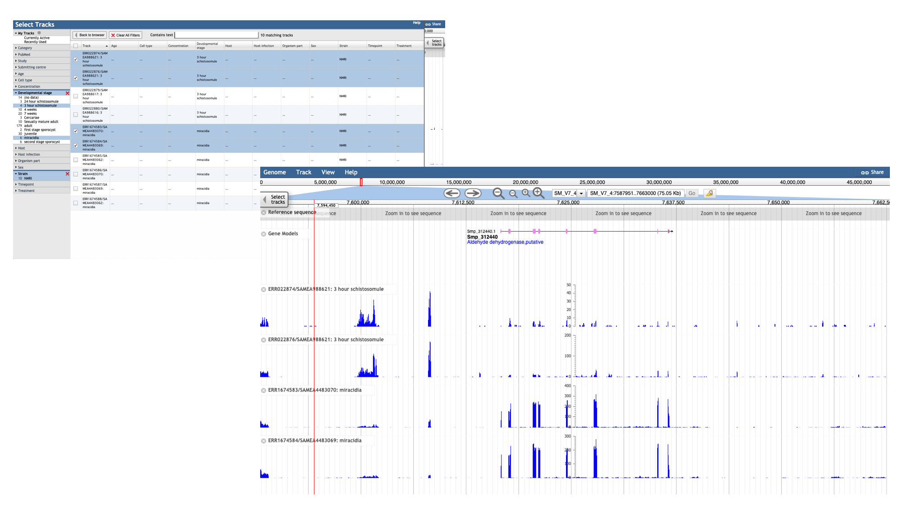

Each track represents a different sequencing library, and shows the number of reads that have been aligned at each position. By mousing over the histogram, you can see the exact number of aligned reads at each base. We can see that a lot of the tracks show biological replicates of the same condition (single sex infections or mixed sex infections). We can use combination tracks to combine replicate tracks “on the fly”, so we use up less space on the screen.

* In the main menu at the top of the page, select “Track” and “Add combination track”.

A new empty track should appear. You can then drag and drop existing tracks in to combine them. When you add additional tracks, a dialogue box should appear for you to select the type of operation to use to combine them. For this example, we’ll choose “addition”: you’ll now see the total number of reads across both selected libraries that aligned at each region. Note that different set operations can be performed, including subtraction, multiplication and division; these might make sense depending on the tracks that are being combined and the information that you’re interested in.

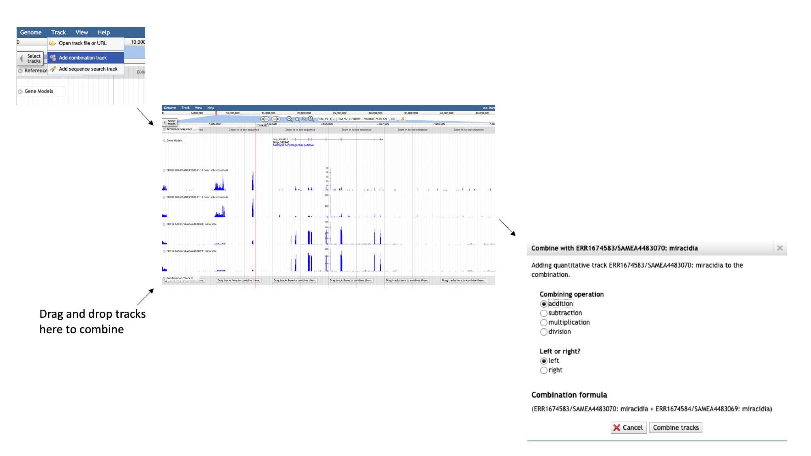

As well as seeing that Smp_312440 is expressed in these conditions, we can use the coverage histograms to assess the quality of the gene model. Most parasitic worm genomes are annotated with automated pipelines. Whilst annotation algorithms can often be very accurate, they are not infallible. Most of the gene models that you look at in WormBase ParaSite will not have been checked by a human curator, so it is important not to take them as “truth” unless you verify that they agree with any evidence that is available.

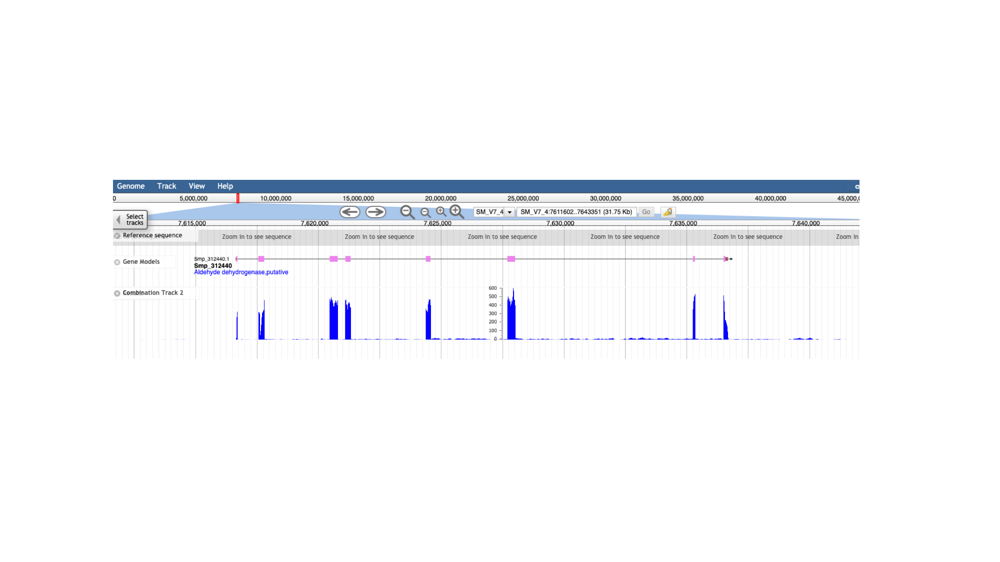

In this case we can see that each of the exons in the gene model have got good RNASeq coverage, with no additional exons suggested by the RNASeq data.

#### Motif searching

It might be useful to have a quick, visual way of showing where certain motifs (short, defined DNA sequences) are found in the reference sequence. JBrowse offers a quick and flexible way to do this. We’ll demonstrate this by generating a track for the TATA box sequence (a sequence found in the promoter region of many eukaryotic genes). The consensus TATA sequence is TATA[A/T]A[A/T] (where [A/T] indicates that either A or T could be present at that position).

* In JBrowse, select “Track” from the main menu bar, followed by “Add sequence search track”.
* Type the motif that we’re searching for in the dialogue box, in this format: TATA[AT]A[AT], and tick “Treat as regular expression”. This means that the [AT] section of the motif will be interpreted as a regular expression (ie, the base in this position can be either A or T). We will limit our search to the forward strand, because that’s the strand that our gene of interest is on. Click “Search”.


Going back to the main JBrowse window, a new track has appeared with all instances of the motif marked. Zooming in to the 5-prime end of Smp_312440, we can see that one of these is well positioned to be our TATA box.

#### Visualising your own data

As well as looking at publicly available data, you can use WormBase ParaSite JBrowse to visualise your own data. We’ll demonstrate how to do this using a BAM file that we have provided for you. BAM is a type of sequence file, in this case of RNA sequencing data. BAM files are binary (i.e., compressed and not human readable) versions of SAM files. SAM files are tab-delimited text files; each line in a SAM file represents a sequencing read, and (optionally) a description of how that read is aligned to a reference sequence.

In the module 3 data directory you should find a file named somules_isoseq_sorted.bam. This is a binary file, so trying to read it as it is won’t be very informative. samtools is a useful software package for manipulating SAM and BAM files. We’ll use a samtools command to convert the BAM file to a SAM file so we can have a look at how it’s structured. Move to the module 3 data directory and type the following into your terminal:


    samtools view -h somules_isoseq_sorted.bam | less

The SAM file starts with a header section. All header lines begin with a ‘@’ character.

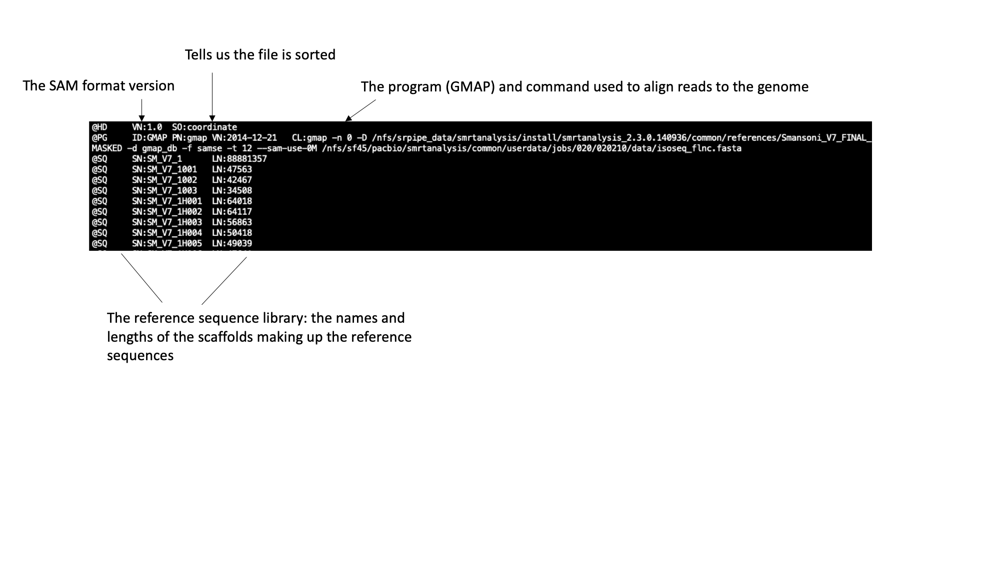

Move down through the file (by pressing the space bar) until you come to the alignment section. Here, each line represents a sequencing read (though be aware that the lines are long, so a single line will probably wrap around your terminal window a few times). Some of the key fields are labelled below:

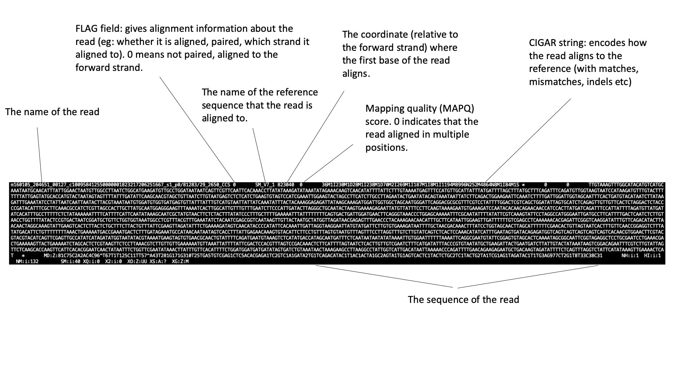

The full SAM specification is available here: http://samtools.github.io/hts-specs/

If you’ve looked at RNA sequencing data before, you may notice something unusual about the reads in this file: they’re very long! Until recently, next generation sequencing reads were typically ~100bp in length, so transcripts had to be sequenced in short sections at high coverage and reconstructed computationally. This BAM file contains “IsoSeq” data, from the Pacific Biosciences platform, whereby full length transcripts have been sequences in their entirety.

Before we can visualise the file in JBrowse, we need to create an index. An index is another file that often accompanies a BAM file, and acts like a table of contents. Software such as JBrowse can look inside the index file and find where exactly in the corresponding BAM file it needs to look, without having to go through all of the reads (which would be computationally very expensive).

BAM index files should have exactly the same name as their corresponding BAM file, with the addition of a .bai suffix. We can index our BAM file using samtools. Type:

    samtools index somules_isoseq_sorted.bam
    
You should now see a file called somules_isoseq_sorted.bam.bai in your working directory. We can now load the file into WormBase ParaSite JBrowse.

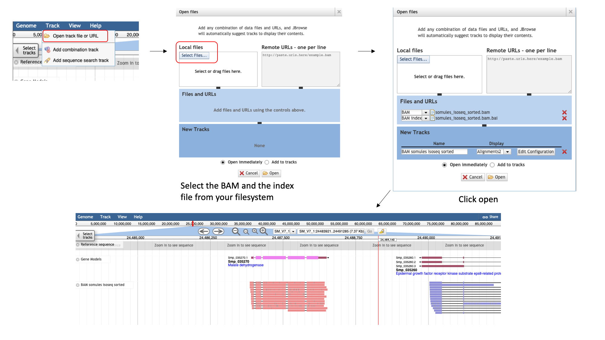

To add the BAM track, select the “Track” menu option in the top left of the screen. Selecting “Open track file or URL” will open a dialogue box giving you an option to view a file that is either on your file system, or accessible via a URL. Select both the BAM file and the index file. JBrowse guesses the file type from the name, but we have an option to correct it if it gets it wrong. We can see that it’s right this time. Click “Open”.

Now we can see the IsoSeq reads aligned to the genome. Notice that IsoSeq data is stranded- this means that the library preparation protocol preserved information on which end of the RNA molecule was 5-prime and which end was 3-prime, so we can infer which strand of DNA it was transcribed from. This information is encoded in the BAM file, and JBrowse colours the reads accordingly: reads aligning to the forward strand are pink, and reads aligning to the reverse strand are purple.

[↥ **Back to top**](#top)

### Expression data <a name="expression_data"></a>

Earlier in this section, we looked at a gene in JBrowse and used RNAseq tracks to see in which life stages it was expressed. What if you were interested in transcriptional differences between life stages, but didn't have a specific gene in mind? You might want to retrieve **all** of the _S. mansoni_ genes that are differentially expressed between life cycle stages. WormBase ParaSite has collated RNAseq data from publicly available studies and analysed it against our genomes and annotations. This means that if somebody has already done the experiment to compare the conditions that you're interested in, you can look up pre-calculated differentially expressed genes. 

* Navigate back to the _S. mansoni_ genome landing page, and select "Gene expression"

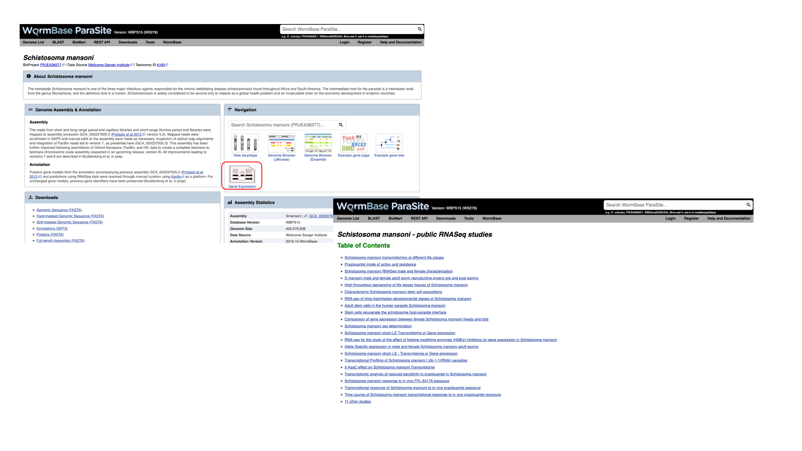

We can see a summary of the different experiments that have been analysed. We're interested in life cycle stages, so select the first experiment "Schistosoma mansoni transcriptomics at different life stages". 

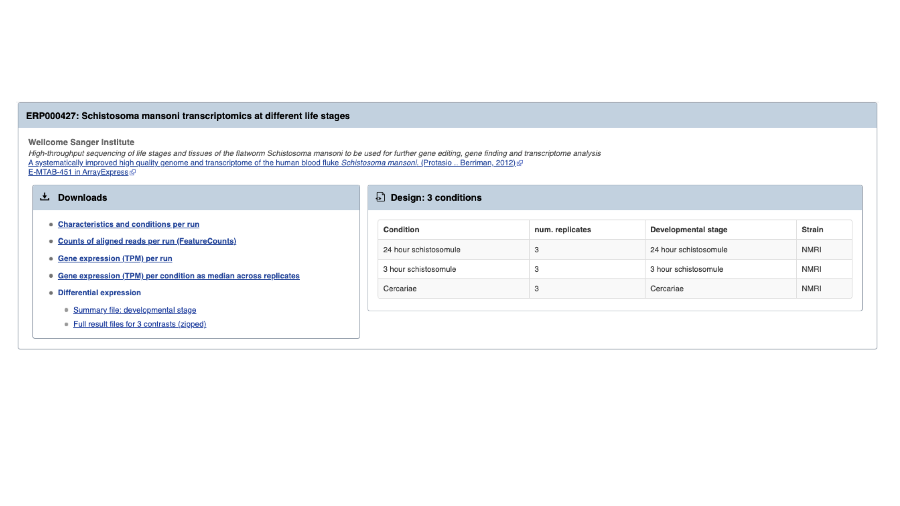

For each analysed experiment, we have a summary of the conditions for which data is available. You'll learn much more about how transcriptomic experiments are analysed in module 7, but for those who are interested we have used TopHat2 to align reads to the genome, HTSeq to quantify counts per gene and DESeq2 to compute differential expression per condition.  Several files are available for download. These are:

* **Characteristics and conditions per run** - a file summarising the metadata available for each sample/run in the experiment.
* **Counts of aligned reads per run (FeatureCounts)** - for each gene, raw counts per sample/run as produced by HTSeq (not normalised for library size).
* **Gene expression (TPM) per run** - for each gene, counts per sample/run normalised for gene length and library size (TPM = transcripts per million).
* **Gene expression (TPM) per condition as median across replicates** - As above, but a median value is calculated from all samples/runs of the same condition.
* **Differential expression** - The number of files here varies. For each experiment, we extract the different facets for which pair-wise comparisons are possible. For this experiment, only one variable is changing between the samples (developmental stage), so we have 3 possible contrasts: 24h schistosomule v 3h schistosomule, 24h schistosomule v cercariae and 3h schistosomule v cercariae. The experiment below is more complicated; we have several facets changing between conditions (drug treatment, development stage, timepoint, strain **and** sex), resulting in many more possible contrasts. We calculate differential expression for any pairwise combination of conditions that have three or more replicates: it's down to you to choose which of those comparisons is biologically meaningful. There are 2 types of file available here:
    1. Summary files: for each combination of variables for which comparisons have been calculated, this file contains the genes that show a significant difference in at least one comparison.
    2. Full results files: each of these files contain the full DESeq2 results for a contrast (i.e., fold changes for ALL genes, whether or not they are statistically significant).

[↥ **Back to top**](#top)

### Expression data exercise <a name="expression_exercise"></a>

Download the full results files for the "Schistosoma mansoni transcriptomics at different life stages" experiment. Use some of the commands you learned yesterday to extract the following information from the "3-hour-schistosomule-vs-cercariae.tsv" file:

1. Extract the top 5 most significantly regulated genes (hint: the final column, "padj", gives the adjusted p value. A smaller adjusted p value = more significant).
2. Of the genes with an adjusted p-value that is less than 0.05, which is (a) most highly upregulated in the 3h schistosomules v the cercariae (b) most strongly upregulated in the cercariae v the 3h schistosomules.

[↥ **Back to top**](#top)

### VEP <a name="vep"></a>

The final WormBase ParaSite tool that we’ll look at today is the Variant Effect Predictor, or VEP. A common approach to understanding the genetic basis of phenotypic differences is to identify genetic variants that are overrepresented in some populations of individuals. For example, you might sequence two populations of worm: one that is susceptible to a drug and one that is resistant to the drug. You could then identify genomic positions where each of these populations differs from the reference genome. VEP is a tool that allows you to predict what the consequences of these variants are: whether they fall within or near genes, and whether they result in a change to the amino acid sequence of a protein.

The standard file format for storing variation data is VCF (variant call format); this is another tab-delimited text format. In the module 3 data directory, we have provided you with a Hymenolepis microstoma VCF file to demonstrate how to use VEP. Have a look at the file first to see how it’s structured (you'll have to scroll down beyond the headers to see the data lines):

    less h_microstoma.vcf
    
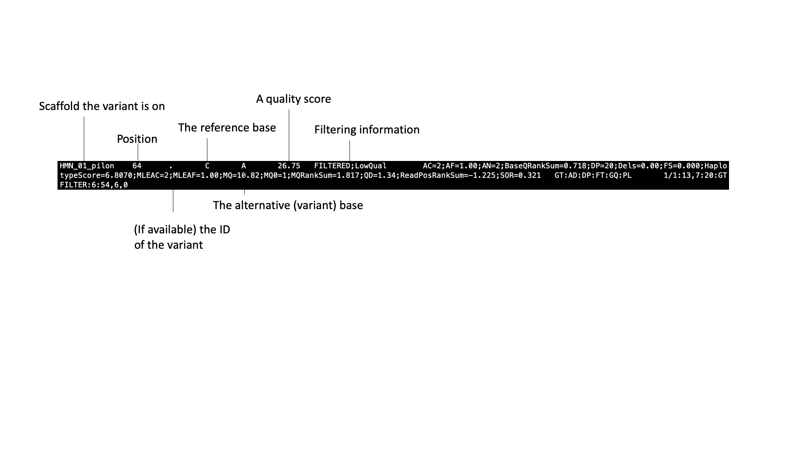

* From the WormBase ParaSite homepage, select “Tools” from the toolbar.
* From the “Tools” page, select Variant Effect Predictor

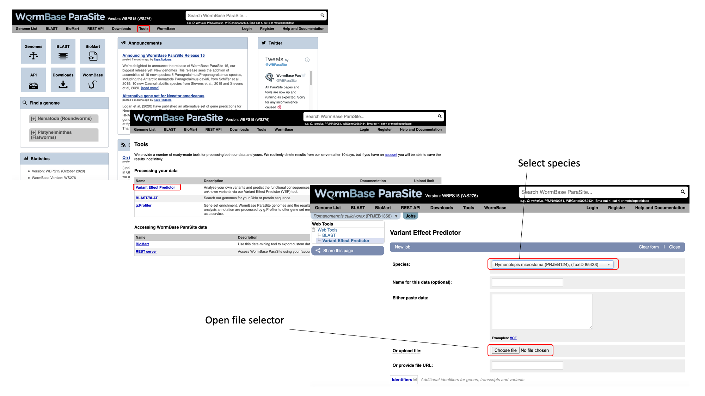

* To submit a VEP job, just select the correct species (Hymenolepis microstoma), upload your VCF file and click “Run”.

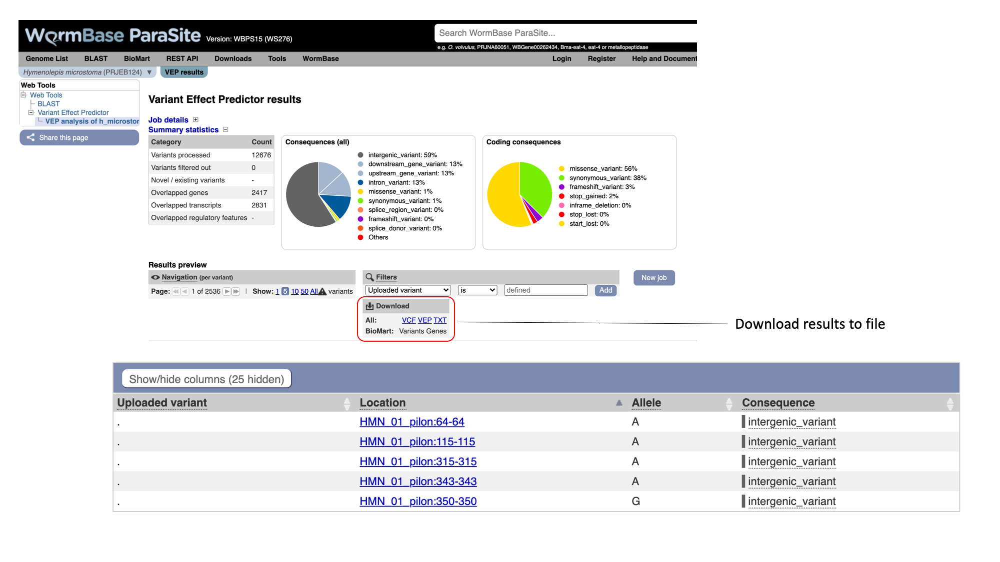

The pie charts give a summary of the consequences of the variants found in the file. Variants with coding consequences are found in the protein-coding sequence of genes, whilst variants with non-coding consequences are in intergenic regions or non-coding regions of genes. These variants could still be functionally important; for example, variants in non-coding regions near genes can have effects on expression levels.
You can explore the results interactively on the webpage, or download them to file.

[↥ **Back to top**](#top)

#### VEP exercise <a name="vep_exercise"></a>

Download the VEP results from the example above as a “VEP file”. Use this file and the original VCF file to answer the following questions:

1. How many variants were there in the original dataset?

2. What is their distribution across the scaffolds of the H. microstoma genome (hint: count how many times each scaffold appears in the VCF file)?

3. What are the different types of consequence that are found in the file, and how often does each occur?

4. List the genes where a ‘stop gained’ variant is found.

5. You’re interested in one particular gene, HmN_002063100. Does it have any variants in the file, and what are the reported consequences? Now view the VCF file in JBrowse and visualise where the variants are in the gene model.

Hint: to view the VCF in JBrowse you first need to compress and index it. Do:

    bgzip h_microstoma.vcf && tabix -p vcf h_microstoma.vcf.gz

[↥ **Back to top**](#top)

## Accessing WormBase ParaSite data programmatically <a name="programmatic_access"></a>

### Working with sequence and annotation files <a name="files"></a>

### The REST API <a name="api"></a>

The other way to query WormBase ParaSite data is programmatically, via the REST API (Application Programming Interface). An API is just another way to retrieve data from a server, but this time via scripts or commands. You make a request to the server, but rather than returning a webpage, it returns the data in a structured format. We offer data in JSON (JavaScript Object Notation) and XML (Extensible Markup Language), which are both commonly used formats for data exchange. They are structured, so good for writing programs to interpret and manipulate them, but also human readable.

There are a few situations where accessing WormBase ParaSite data via the API might be the better choice over BioMart or the website:

1. For queries that you’re likely to have to run multiple times (for example, with different datasets, or against different genomes)

2. For queries that plug into a larger pipeline, it might be convenient to retrieve the data in an easily computer-processable format

3. Some types of data are not available in BioMart (such as CEGMA and BUSCO scores), and can only be accessed via the website or the API

In an earlier exercise, you used the assembly statistics widget on the genome page to compare Brugia sp. genome assemblies. In this example, we’ll do the same for the Meloidogyne sp. assemblies, using the API.

* From the WormBase ParaSite home page, select “REST API” from the toolbar.

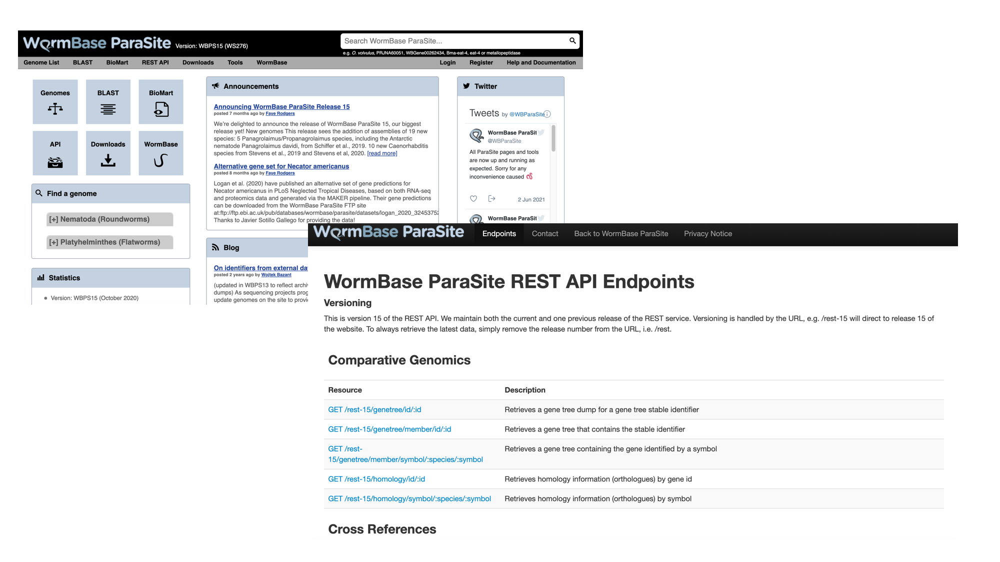

This page details the available REST endpoints: endpoints are URLs that accept API requests, and return data. Read the descriptions of the different resources to see the types of data that you can retrieve from the WormBase ParaSite API.

We want to retrieve the CEGMA and BUSCO scores of all of the Meloidogyne sp. assemblies in WormBase ParaSite. We’ll break the problem down into two steps: first, we’ll use the API to retrieve the names of all the Meloidogyne sp. assemblies that are available, then we’ll use those names to specify which assemblies we want to retrieve the CEGMA and BUSCO scores for.

* Scroll down to the “Information” section and select the taxonomy endpoint


* Scroll down to look at the example request

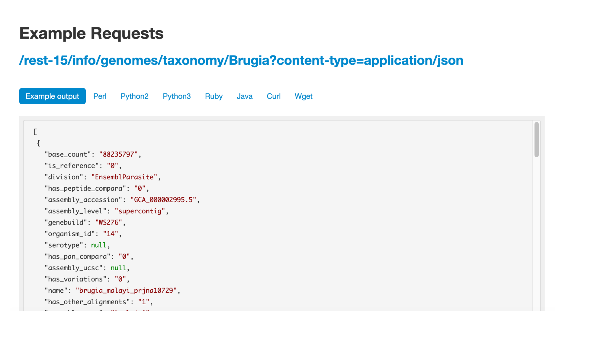

We offer examples on how to use these in several different programming languages - feel free to stick to the language you know best. Here, we’ll demonstrate how to use the command line tool curl. Open a terminal and copy or type the curl command below. We’re interested in Meloidogyne sp., so we have replaced “Brugia” (in the WBPS example) with “Meloidogyne”.

    curl -L 'https://parasite.wormbase.org/rest/info/genomes/taxonomy/Meloidogyne?' -H 'Content-type:application/json'

Note: we’ve also added the L (full name: --location) flag to the curl command, and changed “rest-14” to “rest” in the URL. “rest-14” refers to the 14th release of WormBase ParaSite; by removing the version number the request is automatically redirected to the most recent release. The L flag tells curl to allow this redirection.

You will see a lot of text! This is the data that we requested, in JSON format. To format the response more nicely, we’ll pipe the output into another command line tool, jq. jq allows us to manipulate JSON data on the command line (see the manual for more information on its usage: https://stedolan.github.io/jq/manual/).

    curl -L 'https://parasite.wormbase.org/rest/info/genomes/taxonomy/Meloidogyne?' -H 'Content-type:application/json'  | jq '.'

You should see the data now formatted like this:

```
[
{
"base_count": "235798407",
"is_reference": null,
"division": "EnsemblParasite",
"has_peptide_compara": null,
"dbname": "meloidogyne_javanica_prjeb8714_core_13_95_1",
"genebuild": "2018-05-WormBase",
"assembly_level": "scaffold",
"serotype": null,
"has_pan_compara": null,
"has_variations": "0",
"name": "Meloidogyne javanica (PRJEB8714)",
"has_other_alignments": "1",
"species": "meloidogyne_javanica_prjeb8714",
"assembly_name": "ASM90000394v1",
"taxonomy_id": "6303",
"species_id": "1",
"assembly_id": "GCA_900003945.1",
"strain": null,
"has_genome_alignments": null,
"species_taxonomy_id": "6303"
 ...
},
```

JSON-formatted data consists of key-value pairs. A series of key-value pairs separated by commas and enclosed in curly brackets is a JSON object. Here, we have a JSON object for each Meloidogyne sp. assembly. The JSON objects are in a list (an array), which is enclosed by square brackets. We only need the species names; we will extract these using jq:

    curl -L 'https://parasite.wormbase.org/rest/info/genomes/taxonomy/Meloidogyne?' -H'Content-type:application/json'  | jq -r '.[] | .species'

You should see:

```
meloidogyne_javanica_prjeb8714
meloidogyne_enterolobii_prjna340324
meloidogyne_graminicola_prjna411966
meloidogyne_arenaria_prjeb8714
meloidogyne_incognita_prjna340324
meloidogyne_arenaria_prjna340324
meloidogyne_incognita_prjeb8714
meloidogyne_floridensis_prjeb6016
meloidogyne_floridensis_prjna340324
meloidogyne_javanica_prjna340324
meloidogyne_hapla_prjna29083
meloidogyne_arenaria_prjna438575
```

* Put the list of species names in a file in your working directory:
     
    curl -L 'https://parasite.wormbase.org/rest/info/genomes/taxonomy/Meloidogyne?' -H 'Content-type:application/json'  | jq -r '.[] | .species' > species.txt

The next endpoint that we need is the quality endpoint. Find it on the WormBase ParaSite API endpoint page and have a look at the example.

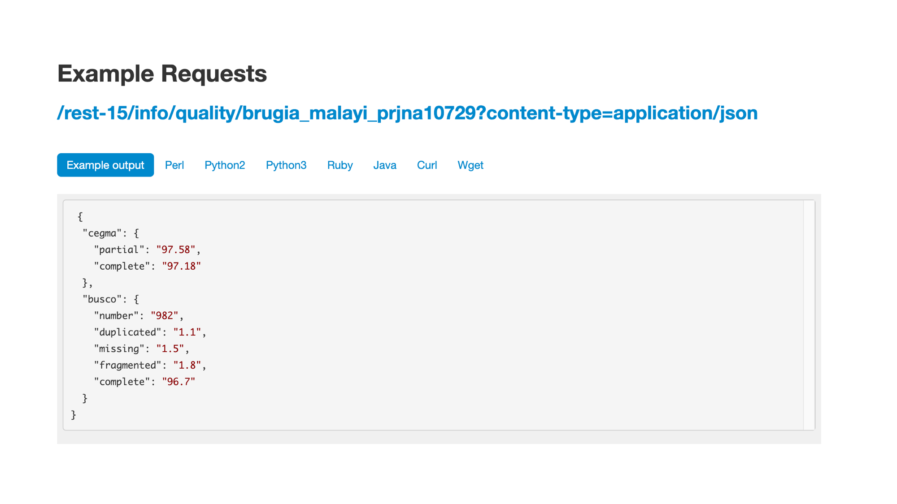e

We will need to replace the species name in the URL, and make a separate request for each species. We can write a small loop in bash, reading from our species file, to achieve this:

```
while read species; do 
   curl -L "https://parasite.wormbase.org/rest/info/quality/$species?" -H 'Content-type:application/json' 
done < species.txt
```

Again, we need to format the JSON nicely to make the output more readable:

```
while read species; do 
   curl -L "https://parasite.wormbase.org/rest/info/quality/$species?" -H 'Content-type:application/json' | jq '.' 
done < species.txt
```

We’ll now produce a file with just the percentages of complete CEGMA and BUSCO genes for each species:

```
while read species; do 
   completeness_score=$(curl -L "https://parasite.wormbase.org/rest/info/quality/$species?" -H 'Content-type:application/json' | jq -r '.cegma.complete,
.busco.complete' )  
   echo $species $completeness_score >> assembly_completeness.txt
done < species.txt
```

Finally, sort that file by CEGMA score:

```
sort -nrk2,2 assembly_completeness.txt

meloidogyne_incognita_prjeb8714 95.97 61.8
meloidogyne_arenaria_prjna438575 95.97 58.4
meloidogyne_arenaria_prjeb8714 95.97 64.7
meloidogyne_javanica_prjeb8714 95.56 61.1
meloidogyne_hapla_prjna29083 94.76 59.9
meloidogyne_javanica_prjna340324 93.55 57.4
meloidogyne_arenaria_prjna340324 91.13 55.8
meloidogyne_incognita_prjna340324 85.89 51.9
meloidogyne_graminicola_prjna411966 84.68 40.7
meloidogyne_enterolobii_prjna340324 84.27 49.7
meloidogyne_floridensis_prjna340324 81.45 49.9
meloidogyne_floridensis_prjeb6016 62.10 29.7
```
We can see that M. incognita, two M. arenaria assemblies and M. javanica all have CEGMA completeness scores of around 96%.

#### API exercises

Adapt the commands that you used above to retrieve the following information from the WormBase ParaSite API. For questions 2 and 3, you’ll need to use different endpoints.

1. List the Meloidogyne sp. assemblies by size, smallest to largest.

2. Retrieve the protein sequence of the guinea worm transcript DME_0000938001-mRNA-1.

2b. Write a small program, `get_sequence_for_transcript`, that takes any transcript ID as an argument and returns its protein sequence. For example, running

    ./get_sequence_for_transcript DME_0000938001-mRNA-1
    
should print MAKHNAVGIDLGTTYSC...

(Hint: shell scripts put arguments from the command line into special variables, named $1, $2 etc )

3. Retrieve a GFF file of all of the genes located on the AgB01 scaffold of the Ascaris suum PRJNA62057 assembly, between the following coordinates: 5284000 to 5836000.

3b. Write a program, `retrieve_genes_in_region` which takes species, scaffold, start and end coordinates as arguments and can return the above for any given region. For example, calling

    ./retrieve_genes_in_region ascaris_suum_prjna62057 AgB01 5284000 5836000

should print the same result as question 3.

Feel free to expand or tweak your programs if you have time!
