# Transcriptomics

## Table of Contents
1. [Overview and Aims](#intro)
2. [Introduction to transcriptome and experiment design](#basic)
3. [Mapping RNA-seq reads to a reference genome](#mapping)
4. [Counting the number of reads mapped to each gene](#readcount)
5. [Import data into RStudio](#Rprep)
6. [Visualising overview of transcriptomic data in R](#pca)
7. [Identifying differentially expressed genes](#de)
8. [Exploring gene expression using gene plots and heatmaps](#plots)
9. [Functional analysis using GO term enrichment](#go)

---

## Overview and Aims <a name="intro"></a>
In this module, we will cover key concepts in RNA-seq transcriptome experimental design and data analysis. We will start from raw data and work toward analysis of differentially expressed genes and functional analysis of gene lists. The example we will use come from Schistosoma mansoni which we have a good reference genome for (and downloadable from Wormbase Parasite). We will use data of S. mansoni from experimentally-infected mice that were collected at different time post-infection. We could ask if and how the worms at different stages are transcriptionally different and how those differences are related, or surprising, given the nature of the worms.

At the end of this module, and the follow-up project module, you will have hands-on experience in
- mapping RNA-seq data to reference genome
- acquiring read counting results and import them to R
- visualising transcriptomic profiles in R
- using R packages to identify differentially expressed genes and finding patterns in the data
- performing GO term enrichment and interpret the results 

---
[↥ **Back to top**](#top)

## Introduction to transcriptome and experiment design <a name="basic"></a>
Understanding when each gene is used helps us to investigate how organisms develop and which genes are used in response to particular external stimuli. The first layer in understanding how the genome is used is the transcriptome. This is also the most accessible because like the genome the transcriptome is made of nucleic acids and can be sequenced using the same technology. Arguably the proteome and metabolome is of greater relevance to understanding cellular biology however it is chemically heterogeneous making it much more difficult to assay.

Over the past decade or two microarray technology has been extensively applied to addressing the question of which genes are expressed when. Despite its success this technology is limited in that it requires prior knowledge of the gene sequences for an organism and has a limited dynamic range in detecting the level of expression, e.g. how many copies of a transcript are made. RNA sequencing technology, using for instance Sequencing-by-Synthesis method, can sequence essentially all the genes which are transcribed including the unknown RNAs.

One of the most common uses of transcriptomic data is possibly for differential gene expression study, which will be covered in this course. However, the extensive and high-throughput nature of the transcriptomic data means there are other potential usages. For example, it can be used to profile total RNA (e.g. miRNA and mRNA) in exosomes and other secretory products; help identify different splice isoforms; provide evidence for gene annotation and improve quality of reference genomes. Meta-transcriptome (combining and re-analysing pool of transcriptomics data from multiple experiments), and comparative gene expression between species could be seen as an extension of differential gene expression. Furthermore, genetic variation particularly SNP calling could use information from transcriptomics data which would carry SNPs from transcribed genes.  

### Designing a transcriptome experiment: things to consider
#### Replicates and power
In order to accurately ascertain which genes are differentially expressed and by how much it is necessary to use replicated data. As with all biological experiments doing it once is simply not enough. There is no simple way to decide how many replicates to do, it is usually a compromise of statistical power and cost. By determining how much variability there is in the sample preparation and sequencing reactions we can better assess how highly genes are really expressed and more accurately determine any differences. The key to this is performing biological rather than technical replicates.

_Technical replicates: random noise from protocols or equipment_
* multiple measurement from the same biological sample e.g. sequencing the same library on multiple lanes, same sample is sequenced multiple times
* do not account for the variability that really exists in biological systems or the experimental error between batches of parasites
* The noise from technical variation is often quite low

_Biological replicates: “true” biological variation_
* From independent and distinct individual/cells/experiments e.g. growing up three batches of parasites, treating them all identically, extracting RNA from each and sequencing the three samples separately, cells that are grown separately, individual plant

_How many replicates to do?_
* The number of replicate affect statistical power in identifying DE genes
* More replicates will help improve power for genes that are already detected at high levels, while deeper sequencing will improve power to detect differential expression for genes which are expressed at low levels.
* For differential expression analysis, most published RNA-seq papers use 3 replicates
* However, some studies suggest at least 6 replicates, and that 12 replicates would allow reliable detection of lowly expressed genes or genes with small changes between conditions 
* If your are able to choose, go for more replicates rather than high number of reads

More discussion on replicates: http://chagall.med.cornell.edu/RNASEQcourse/Intro2RNAseq.pdf 

#### Numbers of reads
The table below shows general recommendation according to Genohub, but real usage can vary depending on your needs. You may recall from the Genetic Diversity module that reduced number of reads, in some cases, can still provide information about genetic variations. If the differences between groups are big, then you may still see the differences even when your have a low number of reads. If the differences are small, however, those small differences may get lost amongst the noises and sample-to-sample variations, such that you will need a higher number of reads to see the biological signals. (For more details, refer to: https://genohub.com/next-generation-sequencing-guide/#depth2)

|Sample type|Reads recommended for differential expression (millions)|Reads recommended for rare transcript or de novo assembly (millions)|
|------|------|------|
|Small genomes (e.g. bacteria, fungi)|5|30-65|
|Intermediate genomes (e.g. Drosophila, C. elegans, most helminths)|10|70-130|
|Large genomes (e.g. human, mouse)|15-25|100-200|

#### Controls and other confounding factors
Although transcriptomes have so much potential, interpretation of its results still relies on good experimental design; therefore, In the same way as any good experimental design, always think about you “control” samples and consider any confounding factors.

Samples are often processed in batch, or if you have many samples or require large amount of output data, they may need to be sequenced on multiple lanes. For this, think about a way to group samples to minimise “batch effect”. See diagram below: 


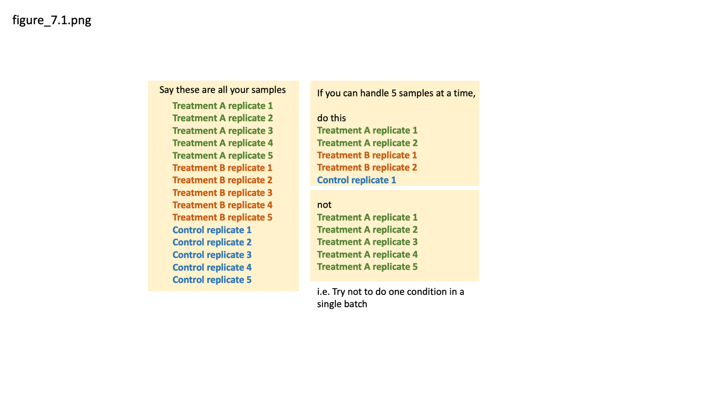  
**Figure 1.** Avoiding batch effect

#### Strand-specificity
Some of the current protocols for preparing RNA-sequencing libraries can retain information on the strand which the RNA have come from. The strand information, in addition to sequences, could be particularly useful if researchers are interested in non-coding RNA, or if the organisms under study is known to have genes overlapping on the opposite strand. 

#### Single-end or paired-end sequencing
In single-end sequencing, each fragment is sequenced from only one end. In paired-end sequencing, the sequencing is done on both ends of the fragment, providing information on relative positions of each pair of sequencing reads. Single-end sequencing is faster to obtain as well as more economical, and it can be a good choice for sequencing of small RNA, or chromatin immunoprecipitation sequencing (ChIP-Seq).

Paired-end data could enable more accurate read mapping (alignment) to the genome, and it is particularly useful for detecting genomic rearrangements, insertion-deletion (indel), identify splice isoforms, or work with repetitive sequence elements

---
[↥ **Back to top**](#top)


## Mapping RNA-seq reads to a reference genome <a name="mapping"></a>
After the experiment has been conducted, RNA extracted, and proceeded to sequencing, each of the sequences obtained is called “read”. The sequences (or reads) often come back as a FASTQ file which could be many gigabytes in size, and this is essentially our raw data for the transcriptome analysis. The very first thing we could do with the data is to QC it, as we have done for the Genetic Diversity module. Then, we map it to the genome and, for gene expression analysis, count the number of reads that map to individual gene locations. 

### Key aspects of RNA-seq mapping and counting
Mapping is a relatively simple step, and below are information that may become helpful when choosing tools and parameters during your read mapping.

#### Spliced mapping
Eukaryotic mRNAs are processed after transcription; introns are spliced out. Therefore some reads (those crossing exon boundaries) should be split when mapped to the reference genome sequence in which intron sequences are still present. TopHat and HISAT2 are one of few mappers which can split reads while mapping them, making it very suitable for mapping RNA-seq of a eukaryote. Splice-aware mapper first identify reads that map within a single exon and then identify splice junction on unmapped reads and map them across exon boundaries.

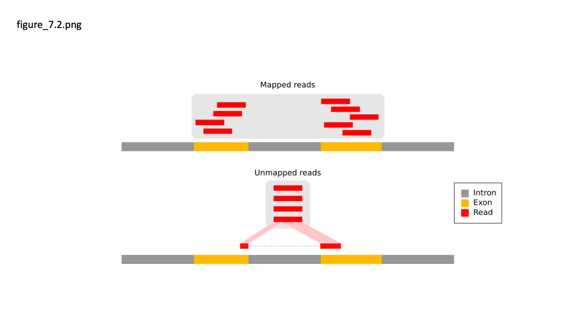  
**Figure 2.** How spliced mapping works (From https://galaxyproject.github.io/training-material/topics/transcriptomics/tutorials/ref-based/tutorial.html)

#### Non-unique/repeated mapping regions
A sequence read may map equally well to multiple locations in the reference genome. Different mapping algorithms have different strategies for this problem, so be sure to check the options in the mapper. Some difficult genome such as that of _Plasmodium falciparum_ has a low GC content (19% GC), which means that reads are more likely to map to multiple locations in the genome by chance. Reads from genes with tandem repeat domains may also encounter this situation. 

#### Insert size
When mapping paired reads, the mapper takes the expected insert size into account. If the insert sizes are expected to on average be 200bp (base pair), and the reads are 50bp, then the insert between the paired reads should be ~100bp. If the paired reads are significantly further apart than expected, the tool can suspect that the reads have not mapped properly and discard them. Removing poorly mapping reads can produce a more reliable mapping.

#### Choosing mapper tools.
Mapping to a genome is more appropriate where you are less confident about the genome annotation and/or you don’t have variant transcripts because your organism rarely makes them or they are simply not annotated. Tophat2 (PMID: 23618408), HISAT2 (PMID: 25751142), STAR (PMID: 23104886) and GSNAP (PMID: 20147302) are all splice-aware RNA-seq read mappers appropriate for eukaryote RNA-seq data. 

Alternative short read mappers which do not split reads include SOAP (PMID: 23587118), SSAHA (PMID: 11591649), BWA (PMID: 19451168) and Bowtie2 (PMID: 22388286), SMALT (Ponstingl, unpublished/https://www.sanger.ac.uk/science/tools/smalt-0). All of these may be appropriate for prokaryote (e.g. bacterial) RNA-seq data. 

If you have a good quality genome and genome annotation such as for human, model organisms (e.g. mouse, zebra fish, _C. elegans_), and well-curated pathogen genomes e.g. _Plasmodium_, _S. mansoni_, we can map RNA-seq reads against transcriptome instead of to the genome. This method of mapping can save lots of time and computing power. Examples of tools for mapping to transcriptome are Kallisto (PMID: 27043002) and eXpress (PMID: 23160280). However, it comes with some limitations, as it relies on gene model being accurate which can only come about from a good quality reference genome. In addition, when mapping to the genome, we can cross check the quality of mapping and the gene model using genome viewer (such as Artemis, Apollo, IGV) and this is not applicable for transcriptome mapping.

New tools for mapping sequence reads are continually being developed. This reflects improvements in mapping technology, but it is also due to changes in the sequence data to be mapped. The sequencing machines we are using now will perhaps not be the ones we are using in a few years time, and the data the new machines produce may require different set of tools but some key concepts will remain relevant.

### Hands on: RNA-seq read mapping
#### Experiment description
We will use data of S. mansoni from experimentally-infected mice that were collected at different time post-infection. These are worms from the lung stage (day 6 after the infection), the liver stage (day 13, 17, 21 after infection), and the adult stage (day 28 when they look like adults, and day 35 when the egg-laying has started and liver pathology can be noticable). Most groups have three biological replicates, except for the lung stage (day-6) where there are 7 biological replicates. Therefore we have 22 RNA samples, each has been sequenced on an Illumina HiSeq sequencing machine. All were sequenced as paired-end. 

#### Mapping
Mapping step generally need a huge computing power and often done on computer cluster or on Cloud. It can take a couple of hours per sample; therefore, for this demonstration, we provide files with reduced number of reads to reduce the processing time but you will still see how the run look like. We then provide output from the mapping that use full dataset and we can use this for the differential expression analysis later this afternoon. 

First, we will use HISAT2 (PMID: 25751142) to map RNA-seq data (in FASTQ format) to genome data (in FASTA format). HISAT2 is a mapper tool and is an upgraded software from the developer of TopHat. It is suitable for RNA-seq data as it also takes into account the splicing of exon-intron which is a characteristic of eukaryotic mRNA. 

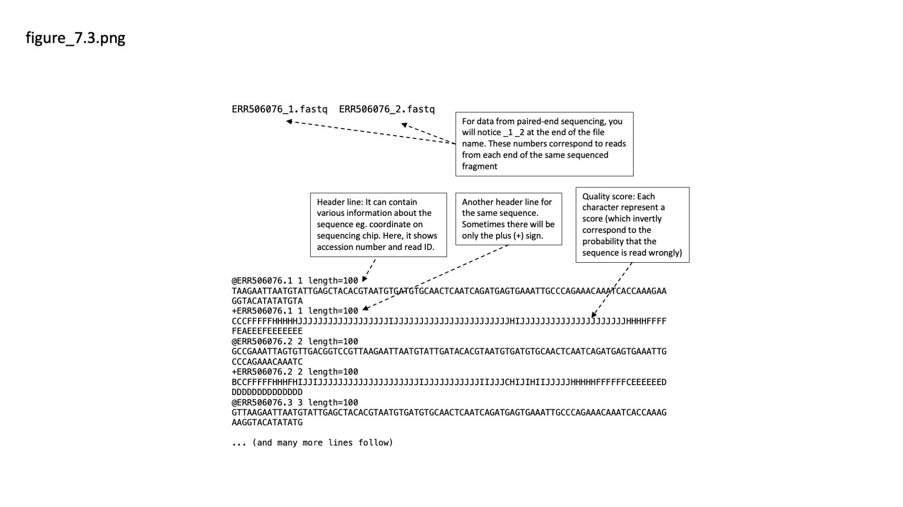  
**Figure 3.** FASTQ file

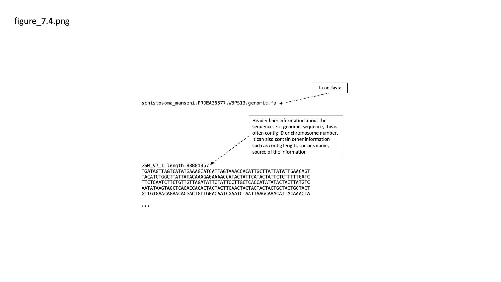  
**Figure 4.** FASTA file

**Note:** For RNA-seq we can often get away without trimming reads before the mapping step. This is because contaminated reads or reads with low-quality would also have low mapping score and will be excluded during the read counting step. However, if the number of mapped reads or mapping results seem off, you may want to look at QC of the raw read data to figure out where things might have gone wrong. 

Use the following command on your Terminal window.

⭐ **Information inside pointy brackets `<>` need to be changed to fit your computer setting**

🚩 **if you see `<some text>` just copy-paste will not work**

🚩 **Remember to use TAB for auto-completion**

```bash 
# Go to the location of the reference genome
cd /<path/to/data>/Module_7_Transcriptomics/References_v5/

# Unzip the reference genome file
gunzip Sm_v5_genome.fa.gz

# Index reference genome so that it can be read by HISAT2
# The template for indexing command is hisat2-build <reference genome in .fa> <prefix for the index file>
hisat2-build Sm_v5_genome.fa Sm_v5_genome.hisat2idx

# ...Wait for the indexing step... This will take about 5-10 minutes...

# Exit the 'References' directory and create a new directory to keep the mapping output
cd ../
mkdir Mapping

# Enter your new directory
cd Mapping
```

Now we will map RNA-seq data to the reference genome using HISAT2. 
As mentioned before, the RNA-seq data for our experiment have been mapped for you separately, this part is only for practicing purpose.
Try `hisat2 --help` to find out what the additional arguments mean.
```bash
# For RNA-seq that come from single-end sequencing
hisat2 --max-intronlen 40000 -x ../References_v5/Sm_v5_genome.hisat2idx -q ../RNAseq_data/Sm_SE.fastq -S Sm_SE.sam

# For RNA-seq that come from paired-end sequencing
# How does the command differ from the one above  for single-end data? 
hisat2 --max-intronlen 40000 -x ../References_v5/Sm_v5_genome.hisat2idx -1 ../RNAseq_data/Sm_PE_1.fastq -2 ../RNAseq_data/Sm_PE_2.fastq -S Sm_PE.sam
```

The **alignment rate** will be shown on the screen. What do you think about the alignment rate of this mapping? 
In which scenerio might you get a low alignment rate? 

The mapping output a SAM file which contain information of the mapping location and scores. 
We will convert SAM file to BAM file, a binary sibling which take less space on a disk and allow faster processing time for the next step (sorting).
```bash
# Convert SAM to BAM using samtools
samtools view -bS -o Sm_SE.bam Sm_SE.sam
samtools view -bS -o Sm_PE.bam Sm_PE.sam

# See the file size differences between the SAM and BAM files
ls -lth

# Sort BAM file
samtools sort -n -O BAM -o Sm_SE_sorted.bam Sm_SE.bam
samtools sort -n -O BAM -o Sm_PE_sorted.bam Sm_PE.bam
```
---
### Exercise 7.1
Now that SAM files have been converted to BAM, the SAM are no longer useful and they take up a lot of space. Use Unix commands to:

1) List all SAM files in the current directory

2) Remove all SAM files *Make sure you do not accidentally delete BAM files; they are needed for the next step!*

---
[↥ **Back to top**](#top)


## Counting the number of reads mapped to each gene <a name="readcount"></a> 
Now we have output from the mapping as BAM file. This explains where on the genome do each of the sequencing reads mapped to. Next we can combine this information with a file that says which location on the genome is what genes, a GFF or GTF file. HTSeq (PMID: 25260700) is a popular tool for this purpose.

### Annotation files
The file that contains annotated information of a genome is known as GFF (General Feature Format) or GTF (General Transfer Format) file. These are annotation files, with each line containing one feature and its related information. The information is displayed in tab-separated fields. Both file types contain similar information but formatting are slightly different (more details: http://m.ensembl.org/info/website/upload/gff.html). Some software can take either type as input. For software that asks for a specific type, they can be converted using a tool such as gffread.

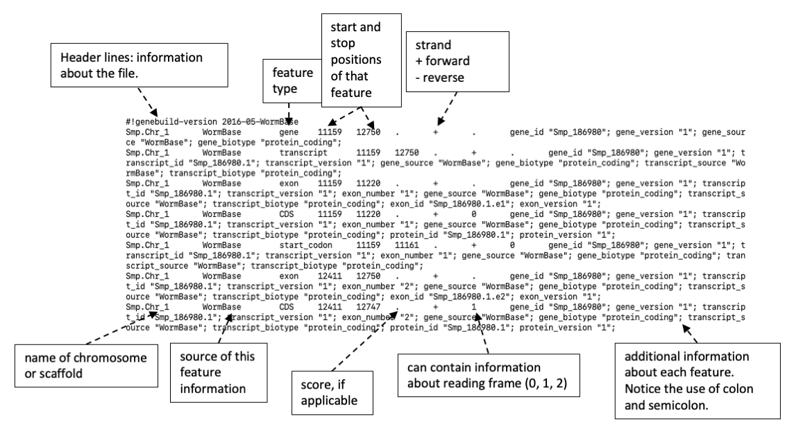
**Figure 5.** Example of a GTF file

Use HTSeq-count to calculate the number of reads mapped to each gene
See https://htseq.readthedocs.io/en/release_0.11.1/count.html or do `htseq-count --help` to see meaning of these options. The manual and `--help` option can also be useful if you encounter an error message.

```bash
# First, unzip the GTF file so that it can be read by htseq-count
# Go to Reference_v5 directory which is where the file is kept
cd ../References_v5/
ls  # you should see a file called Sm_v5_canonical_geneset.gtf.gz
gunzip Sm_v5_canonical_geneset.gtf.gz
ls  # now the file Sm_v5_canonical_geneset.gtf.gz should become Sm_v5_canonical_geneset.gtf

# Go back to Mapping directory
cd ../Mapping/

# Run htseq-count
# htseq-count <various options> <sorted BAM file> <GTF or GFF file with gene annotation>
# For Sm_PE_sorted.bam file
# The > means 'take the screen output to this file'
htseq-count -a 30 -t CDS -i gene_id -s yes -m union Sm_PE_sorted.bam ../References_v5/Sm_v5_canonical_geneset.gtf > Sm_PE_htseqcount.txt

# Now try it yourself for the Sm_SE_sorted.bam file
?????

# Explore one of the HTSeq-count output files
# Use up-down arrows to move long the files, or press the spacebar or D to move down a page, press B to move up a page
less Sm_PE_htseqcount.txt
```

Output from HTSeq-count contain `STDOUT` (standard out; telling progress and key steps while the tool is running) and `STDERR` (standard error; error or warning messages) followed by the number of reads that mapped to each gene. We only need the read count information for downstream analyses. 

```bash
# Create a directory called “final_counts” to keep count files
mkdir final_counts

# Filter HTSeq-count output files into a new file, keeping just the lines with gene IDs (Smp for S. mansoni) and their read counts 
grep "^Smp" Sm_PE_htseqcount.txt

# That output way too much stuff on the screen, try `head` command to output just the first 10 lines
grep "^Smp" Sm_PE_htseqcount.txt | head 

# What we want here is to grep lines that start with Smp from a file, then sort the grep output, write this sorted output to a new file
grep "^Smp" Sm_PE_htseqcount.txt | sort > final_counts/Sm_PE_htseqcount.final

# Now try it yourself for the Sm_SE_sorted.bam file
?????
```

We should now have files containing the number of reads mapped to each gene within each demo samples. Next step, we will import read count data into R and run differential expression analysis. 

We mapped and performed read counting for two example samples so far, the real samples have been done for you and are in a directory called  `v5counts`.

---
[↥ **Back to top**](#top)


## Setting up RStudio <a name="Rprep"></a>
We will move from Unix commands into R. We could run R on the Terminal, but more conveniently, we could run R on RStudio which provide graphical user interface and keep scripts and output neatly in one windows. 

First, open RStudio and create a new R Script file (or RMarkdown file if you prefer). This will produce a blank file in the window on the top left. Save it to a meaningful name. While doing the analysis, we recommend typing, or copying, commands in this handbook into the R script area and then choose the line and run from there (using “Run” button next to the script area, or `Ctrl+Enter` shortcut key). This way we will have all the commands neatly stored in the script area which will make it easier to trace back, re-do, or edit if necessary. 

While using RStudio, you can get help by typing command 
- `?functioname` (function manual will appear on the Help section), 
- or `??functioname`  (a list of functions with similar name to your query will appear on the Help section - very useful when you are not quite sure how the function is called). 

You can also find help online. If you Google your bioinformatics and R questions/struggles, it is amazing how someone had already asked that question and some answers had been provided. You might often find links to a forum on https://www.biostars.org/ or https://stackoverflow.com/. 

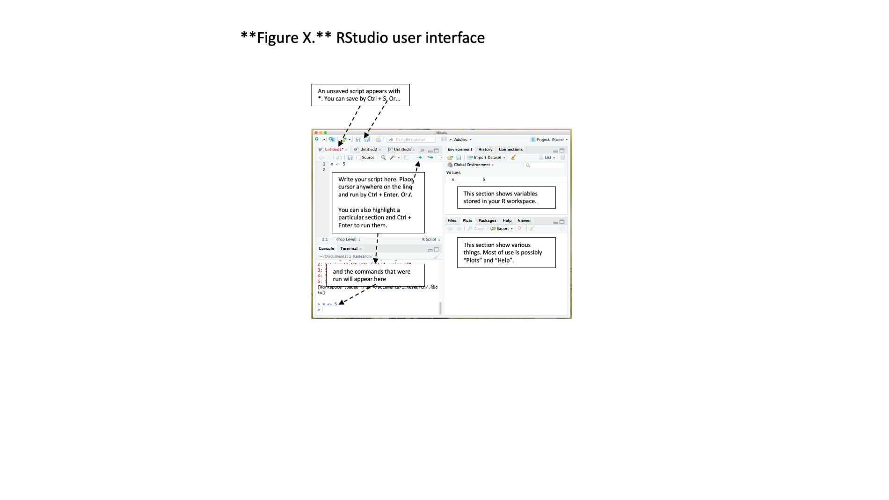
**Figure 6.** RStudio user interface

### Prepare your R workspace
The packages that we will load have previously been installed on the computer, and now we need to pull them, using `library()` command, into our current R environment. 

**Note:** If you want to run this analysis on a different computer, you may need to first install the packages, but this task is often straightforward. R packages that we use are mainly from **Bioconductor** repository, or from **CRAN (The Comprehensive R Archive Network)**. 

As an example, to install `topGO`, which is an R package on Bioconductor, we just need to follow few lines of commands from this page https://www.bioconductor.org/packages/release/bioc/html/topGO.html. To install a package from CRAN, such as `ggplot2`, we use command `install.packages("ggplot2")`.

Let's get your R workspace set up

```R
# Set up work directory
# setwd command set working directory for the current R session. After running this line, if we import or export files without defining a specific directory, R will assume the current working directory as your destination.
# the path to your data is considered a "string" or "character" in R, so we need to put it inside a quotation mark
setwd("/<path/to/data>/Module_7_Transcriptomics/")

# To keep our filing system tidy, let's create a new directory to keep outputs from R analysis
dir.create("R_analysis")

# You can check on your Terminal or in File that a new directory called "R_analysis" has been created.

# Enter the directory R_analysis that you just created
setwd("./R_analysis")

# Load required packages into R environment 
# R comes with standard packages (i.e. set of tools). We use library command to load additional tools that we need for RNA-seq data analysis
library(DESeq2)   		# for doing expression analysis
library(topGO)    		# for running GO term enrichment
library(ggplot2)  		# for (visually pleasing) plots
library(pheatmap) 		# for (visually pleasing) heatmaps
library(RColorBrewer) 	# for a wider range of plot colours
```

### About DESeq2
This is an R package for performing differential expression analysis (PMID: 25516281). It can take read count data in various forms, one of those is read count tables from HTSeq-count. The tool provides simple command lines for formatting read count data, normalization, exploring variances between samples, and performing differential expression analysis. It is one of the tools widely used for RNA-seq data analysis and it also provide detailed manual which help make it more user-friendly (http://bioconductor.org/packages/devel/bioc/vignettes/DESeq2/inst/doc/DESeq2.html)

### Alternative softwares
In addition to `DESeq2`, there are a variety of programs for detecting differentially expressed genes from tables of RNA-seq read counts. Some of these tools work in R, while some require Unix interface. Examples of these tools include EdgeR (PMID: 19910308), BaySeq (PMID: 20698981), Cuffdiff (PMID: 23222703), Sleuth PMID: 28581496 (an accompanying tool for read count data from Kallisto).

## Import read count data into R
We will tell R where the read count data are kept, and then create a table with metadata of our samples. The format of the metadata table will change with the tools that you use. What is demonstrated here is for DESeq2.

```R
# Tell the location of the read count files
# Create a datadir object to keep the path to the directory v5counts in your module 7 files
datadir <- "/<path/to/data>/v5counts/" 

# list files in this directory, output as an R vector
list.files(datadir)   # this should list 22 files
sampleFiles <- list.files(datadir)    # this save that 22 file names into a new R object		

# Create sample names
# split the name at “_v5.counts” and keep the resulting output in a new vector
name <- unlist(strsplit(sampleFiles, split = "_v5.counts", perl = TRUE))
name

# Create metadata information - match with sample names
condition <- c(rep("D06",7), rep("D13",3), rep("D17",3), rep("D21",3), rep("D28",3), rep("D35",3))
replicate <- as.character(c(1,2,3,4,5,6,7, rep(c(1,2,3),5)))

# Put together into a metadata table called sampleTable
sampleTable <- data.frame(sample_name = name, file_name = sampleFiles, condition = condition, replicate = replicate)
sampleTable
```

Next, we will use the metadata to create an object in R that DESeq2 can use

```R
# Create DESeq2 object from read count files and sample metadata information 
# design =~ condition indicates which variable(s) in sampleTable represent experimental design. In this case, it is the condition column.
ddsHTSeq <- DESeqDataSetFromHTSeqCount(sampleTable = sampleTable, directory = datadir, design =~ condition)

# Apply normalization and statistical model to the read count data 
# dds contain normalised counts, which can be access by counts(dds, normalized = TRUE)
# The output message denotes steps that this DESeq function performs. One of the steps is estimation of size factors which is the normalisation for differences in the total number of reads of the samples. Details can be found by typing ?DESeq.  
dds <- DESeq(ddsHTSeq)
```

### Normalization
Numbers of read counts from the HTseq-count output is not ready-to-use for gene expression comparison and need to be normalised first. This is because the number of reads mapped to a gene can be affected by many factors, including the actual gene expression level (which is often most relevant to our research question), gene length, total sequencing output of that sample, the expression of all other genes within that sample. Normalisation take these into account. For more details of normalization method used by DESeq2, see tool manual [here](http://bioconductor.org/packages/devel/bioc/vignettes/DESeq2/inst/doc/DESeq2.html). 

For exploratory analysis (such as principal component analysis), the results can be strongly influenced by genes with very low or very high read counts. We can avoid this issue by apply logarithm to the normalised counts. `rlog` (or regularized-log) is a  transformation method supplied with DESeq2.

```R
# Transform normalised read counts into log value 
rld <- rlogTransformation(dds, blind = FALSE)
```
---
[↥ **Back to top**](#top)


## Visualising overview of transcriptomic data in R <a name="pca"></a>
We will use exploratory analyses and plots to see te overview of our dataset before digging into gene-level details.

### Principal Components Analysis (PCA)
The Principal Components Analysis plot shows the relationship between the samples in two dimensions. Hopefully, technical and biological replicates would show similar expression patterns (i.e. they are grouped together tightly on the PCA plot); whereas, samples from different experimental conditions, or distinctive time points, would form separate groups. In this case, day-6 worms, liver stage worms, and adult worms are separated from one another. The replicates are more similar to each other than they are to samples from the different condition. In some cases we can identify outliers, e.g. samples which do not agree with other replicates and these can be excluded. If we don’t have many replicates, it is hard to detect outliers and our power to detect differentially expressed genes is reduced.

`plotPCA` is a function in DESeq2 package. R also have internal PCA function, but the usage is more complicated
`intgroup` indicate how we want to present each data point on the plot. In this case, we label data points based on their groups under the column `condition` of the `sampleTable`

```R
# Create PCA plot 
plotPCA(rld, intgroup = c("condition"))
```

You should get something similar to this. 
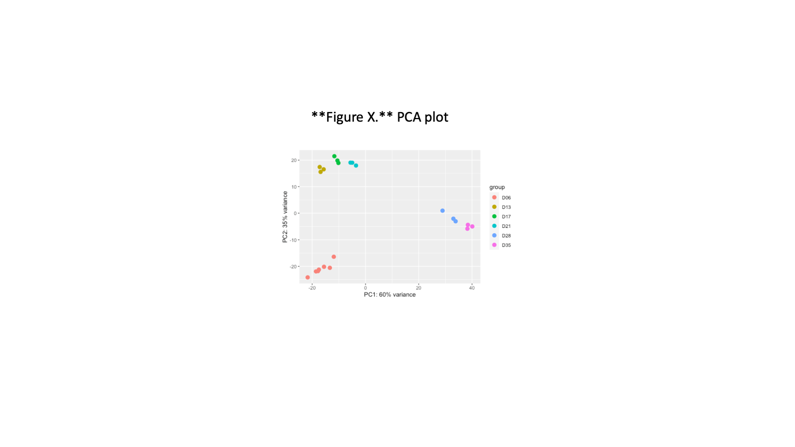
**Figure 7.** PCA plot

Save the plot to PDF file using `dev.copy()` function. `dev` mean device, and this refers to the plotting space in your RStudio, as well as a new "device" that is opened as a new file on your computer. Once the plotting to a new "device" is done, we must do `dev.off()` to close the device so that the plot can be viewed. 

```R
dev.copy(pdf, "PCA.pdf")
dev.off() 
```

---
**Box 1: Saving graphic produced in RStudio**
**Save as PDF**
```R
# Name the file as you like it, but try to keep it meaningful.
# Other options we can define when exporting a plot
# Remember that text in R need to be inside a quotation mark - single quote or double quote is fine
dev.copy(pdf, "__________", width = 11, height = 7) 
dev.off()
```
**Save in other file format**
The `...` in the commands below represents arguments that specify characteristics of output files. 
These arguments could be 
`height =`
`width =`
`res = (resolution)`
_For a jpg file_, dimensions are defined in pixels. If you want A4 at 300 dpi, the parameters would be height = 3510, width 2490, res = 300
_For pdf and ps files_ dimensions are in inches. For A4, it is height = 8.3, width = 11.7

To output R graphics into other file types, first we run one of the following commands to create a file of that type.
Then run a command that create a plot, this will be plotted onto the file we just created
Then we do dev.off() to close the file so that it can be viewed
```R
pdf(file = "filename.pdf", ...)
jpeg(filename = "filename.jpg", ...)
png(filename = "filename.png", ...)
postscript(file = "filename.ps", ...)

# For example
jpeg(filename = "top20.jpg", width = 800, height = 600)
pheatmap(top20_genes)
dev.off()
```
Remember to dev.off() or the file cannot be opened

---

The PCA plot can also be created differently; perhaps we want the data points to be of different sizes or we want to represent different stages of the worms using "shape" instead of "colour". We can use ggplot for this. 

```R
# Produce a PCA plot and keep plot attributes and parameters to a new object called PCA
PCA <- plotPCA(rld, intgroup = c("condition"), returnData = TRUE)
percentVar <- round(100 * (attr(PCA, "percentVar")))

# Use the information to produced a more customisable PCA
# making data points and text larger
ggplot(PCA, aes(PC1, PC2, color=condition)) +
geom_point(size=5) +
xlab(paste0("PC1: ",percentVar[1]," % variance")) +
ylab(paste0("PC2: ", percentVar[2], "% variance")) +
theme(text = element_text(size = 15))

# represent different groups with shape instead of colour
ggplot(PCA, aes(PC1, PC2, shape=condition)) +
geom_point(size=5) +
xlab(paste0("PC1: ",percentVar[1]," % variance")) +
ylab(paste0("PC2: ", percentVar[2], "% variance")) +
theme(text = element_text(size = 15))
```

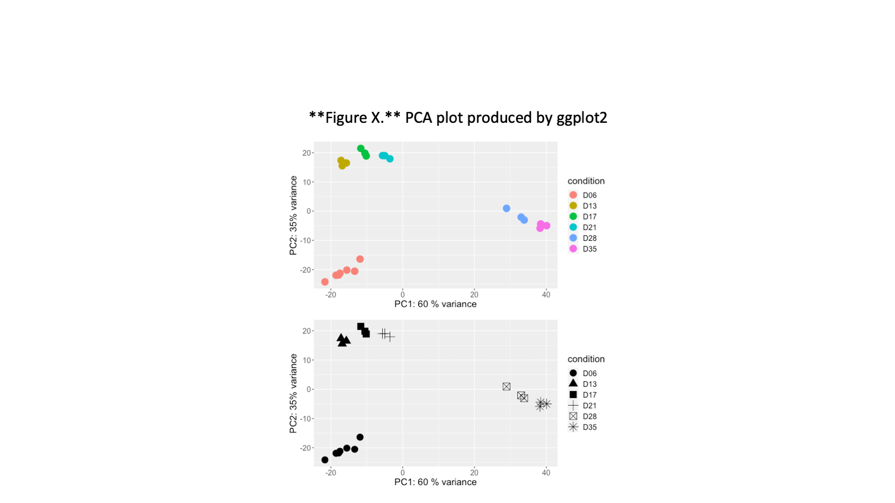
**Figure 8.** PCA plot produced by ggplot2

---
### Mini exercise
- Try saving this plot into a file format of your choice
- How could you specify the colour or shape that go with each group? (e.g. how would you tell R so that D06 group is shown in red, D13 group is shown in orange). Try using Google to help you find the answer

---

### Distance matrix
In some cases, clustering of samples on PCA plots may not show whether there is a clear distinction groups. We can also use different types of clustering such as sample heatmap. To create sample heatmap, we measure overall profiles and relationship between samples using a distance matrix. We will create a distance matrix (using `dist()` function) from normalised and log-transformed reads (the `rld` object created earlier using `rlogTransformation` command), and then visualise it on a heatmap. 

The `rld` object has a few attributes. We use function `assay()` to extract just the number matrix, which is a required input for the `t()` (transpose) and `dist()` functions.

```R
# Create a distance matrix between each sample
sampleDist <- dist(t(assay(rld)))
sampleDistMatrix <- as.matrix(sampleDist)

# Prepare annotation for the heatmap
rownames(sampleDistMatrix) <- rld$condition
colnames(sampleDistMatrix) <- NULL

# Set heatmap colour scheme
# colorRampPalette took the input (vector of colour codes), and interpolate that into a number of shades (in this case, we says 255)
# The following code means pick 9 colours from Blues palette. 
# brewer.pal is part of the RColorBrewer package that we load at the start of RStudio. 
colors <- colorRampPalette(rev(brewer.pal(9,"Blues")))(255)

# Create heatmap
pheatmap(sampleDistMatrix, clustering_distance_rows = sampleDist, clustering_distance_cols = sampleDist, color = colors)
```

This should output a plot similar to one below
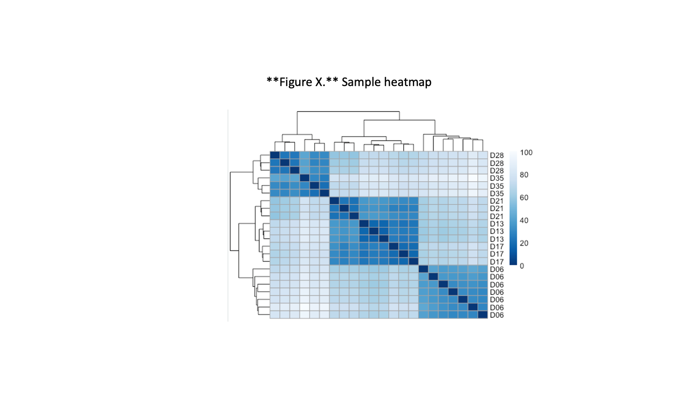
**Figure 9.** Sample heatmap

```R
# Save the plot to a PDF file
dev.copy(pdf, "sampleheatmap.pdf", width = 6, height = 4)
dev.off()

# Alternatively, we can create heatmap using an R internal heatmap function
heatmap(sampleDistMatrix, Rowv = sampleDist, Colv = sampleDist, cexRow = 0.7, labCol = FALSE)
```
---
[↥ **Back to top**](#top)


## Identifying differentially expressed genes <a name="de"></a>
Now that we have explored overall relationship between samples based on their transcriptome profiles, we can go deeper into the data and explores genes expression that are different between samples - i.e. between experimental/biological conditions. 

In its simplest view, differential expression analysis test for differences between 2 or more groups when we have one or more factors that could contribute to the observed differences. However, in transcriptomic data, we often have a much lower number of replicates, data are not normally distributed, and we are testing differences in many genes at the same time. Methods and tools for analysing differential gene expression; therefore, have some specific terminology and concepts as we shall see next!

### Genes differentially expressed between conditions
Using the DESeq `dds` object we created earlier, we can look at the differentially expressed genes using `results()` function. By default, DESeq2 perform pair-wise comparison of the first and the last variable in the experimental design variables and provide a result table.

```R
# Access result of differential expression analysis
res <- results(dds)
head(res)
```

The result table contains several columns, of which the most relevant are:
- Rowname, indicating gene id
- Column 1: baseMean, average expression level across all samples normalised by sequencing depth
- Column 2: log2FoldChange, in this table below, of D35 / D06
- Column 6: padj, adjusted p-value, p-value corrected for multiple testing

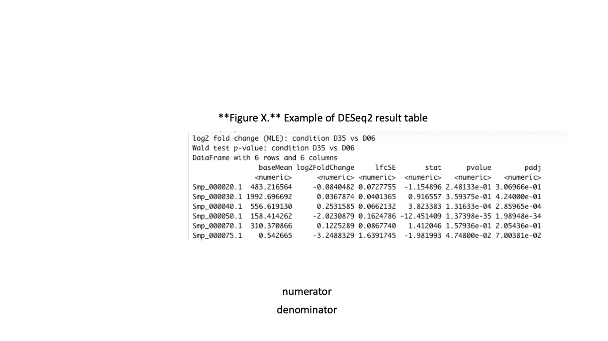
**Figure 10.** Example of DESeq2 result table

### Log2 fold change
Fold change is calculated from a ratio of normalised read counts between two conditions of interest. However, level of gene expression changes are often shown as log2 fold change. Using log2 value become particularly helpful for visualising the gene expression changes. Furthermore, it eventually become intuitive that log2FC of 1 means expression level double in a given condition, and a negative log2FC means the gene is down-regulated in a given condition. 

### P-values, q-values and multiple-testing problem
We might be familiar with using p-value as a statistically significant cut-off (such as at p-value = 0.05) when you study one gene. Essentially, p-value of 0.05 means there is a 5% chance that the difference observed is due to chance (false-positive). Now, when we talk about transcriptome , we can be looking at 10,000 genes at once and the chance of false-positive hits, collectively, then become 0.05 * 10,000 = 500 hits! That is too much to obtain reliable results, and this is known as a multiple-testing problem - the more you carry out a test, the more likely you would end up with some positive results just by chance. To overcome this, we will, instead, use q-value, also known as adjusted p-value, which can be calculated from the p-value, its distribution, and taking the number of tests into account. Thankfully, we often don’t need to do the calculation ourselves, as data analysis tools often provide the adjusted p-value. Therefore it is an adjusted p-value of less than 0.05 (or other cut-off) that we should be looking for when asking whether a gene is differentially expressed.

### Cut-off for calling a gene differentially expressed
In this manual, we choose 1 and -1 log2 fold change (log2FC) as a cut-off. This means the gene expression that increase 2 times or decrease 2 times in a given comparison (e.g. log2 fold change of 1 mean expression of gene A in group1/expression of gene A in group2 = 2). If you want to reduce the number of DE genes, or think the statistical power of your study isn’t high (e.g. having a low number of replicates or a low number of reads), you may consider increasing the cut-off for calling genes differentially expressed (e.g. change to 3). Similarly, if you expect the nature of changes to be small, or for example, if you treat cells in batch/large chunk but expected that the treatment will only affect part of the cells (diluting the effect size) then you might want to consider reducing the cut-off of te log2 fold change (e.g. to 0.5).

## Compare gene expression between 2 conditions 
Using the same `results()` command, with additional arguments, we can explore pair-wise comparison between any two given groups of samples. For example, we may be interested in differences between day-13 and day-6 worms. We can use the commands below. 

Using `contrast()`, we can specify groups of samples to be compared. _Notice the order by which the condition names are mentioned for the `contrast`_; this example means `D06` is denominator in the log2 fold change calculation.

```R
# Create a result table for D13 vs D06
# alpha = 0.01 specify the adjusted p-value cut off to use when summary() function count the number of differentially expressed genes
res_D13D06 <- results(dds, contrast = c("condition", "D13", "D06"), test = "Wald", alpha = 0.01) 

summary(res_D13D06, alpha = 0.01)

# Explore top-20 differentially expressed genes based on adjusted p-value
res_D13D06[order(res_D13D06$padj),][1:20,]

# To look at genes that were up-regulated in day-13 worms
# The which function returns positions where the condition is TRUE?
# Because we are looking at genes with higher expression in day-13 group, which is the numerator, log2FC will be positive. We could use cut-off of log2FC > 1 & padj < 0.01
res_D13D06[which(res_D13D06$log2FoldChange > 1 & res_D13D06$padj < 0.01),]
```

---
### Exercise 7.2
Look at the result of differential gene expression analysis between day-13 and day-6 worms. 

1) How many genes are up-regulated in day-13 worms compared to day-6 worms?

2) How many genes are up-regulated in day-6 worms? 

3) Try using WormbaseParasite to explore some of the top differentially expressed genes ranked by log2FC.

---

[↥ **Back to top**](#top)


## Exploring gene expression using gene plots and heatmaps <a name="plots"></a>
We have looked at the results of pairwise comparison so far in form of large tables with multiple columns and thousands of rows, representing all genes in _S. mansoni_. This information can be visualised using **MA plots** (log2FC and mean expression level) and **volcano plots** (log2FC and adjusted p-value). We can also plot expression of a particular gene across all samples. 

**MA plot**

```R
# We can use plotMA() function which come with DESeq2 package
plotMA(res_D13D06)

# The upward- and downward-pointing triangles indicate that there are data points beyond the axis limits of this plot. We can adjust the plotting commands to put those points in the plot. 
plotMA(res_D13D06, ylim = c(-13,8))

# Also, we make the plot easier to read and more complete by adding titles and axis labels, and set a new size for each data point. 
plotMA(res_D13D06, ylim = c(-13,8), main = "log2 fold changes day-13 VS day-6 S. mansoni", ylab = expression(paste(log[2],' fold change')), cex = 0.75)

# We might want to draw lines on the plot to mark the -1 and 1 cut-off for log2FC
abline(h = c(-1,1))
```

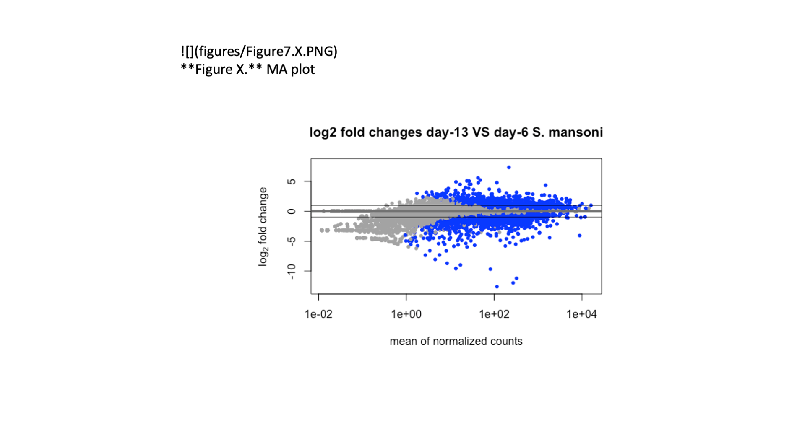
**Figure 11.** MA plot

**Volcano plot**

```R
# We will use result table from pair-wise comparison between D13 vs D06
res_D13D06

# Make input readable for ggplot
res_D13D06_df <- as.data.frame(res_D13D06)

# Define threshold to mark genes with different colours
# We take absolute value of log2FC to cover both up- and down-regulated genes
res_D13D06_df$threshold = as.factor(abs(res_D13D06_df$log2FoldChange) > 1 & res_D13D06_df$padj < 0.01)

# Create a volcano plot
ggplot(data=res_D13D06_df, aes(x=log2FoldChange, y=-log10(padj), colour=threshold)) +
geom_point(alpha=0.75, size=3) +
theme(legend.position="none", text = element_text(size = 15)) +
xlab(expression(paste(log[2],' fold change'))) +
ylab(expression(paste('-', log[10],' adjusted p-value'))) +
ggtitle("D13 VS D06")
```

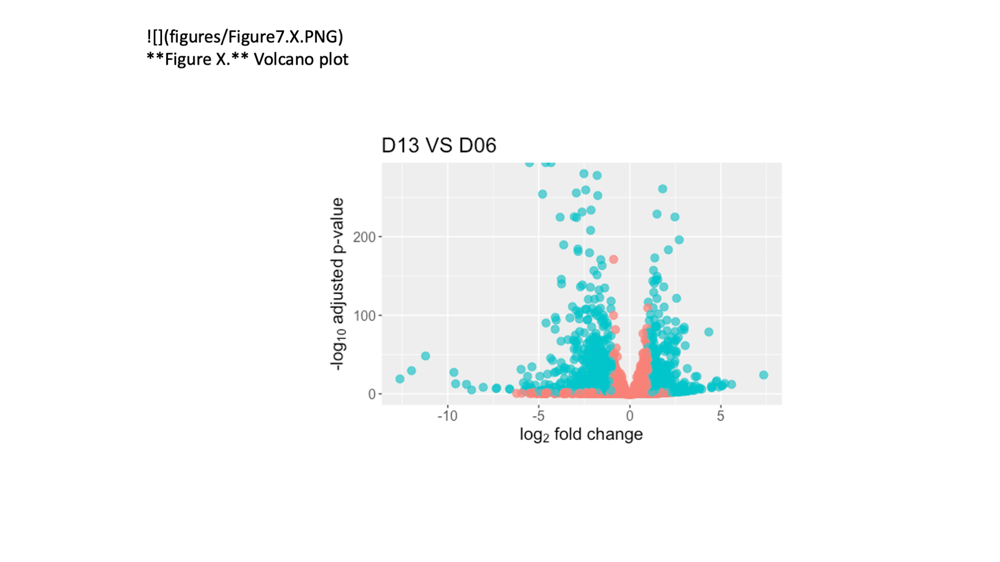
**Figure 12.** Volcano plot

**Individual plot for a gene**

```R
# Smp_022450.2 is a gene from the top-20 lowest adjusted p-val list 

# Use plotCounts which come with DESeq2 package
plotCounts(dds, "Smp_022450.2", intgroup = c("condition")) 

# Or use ggplot
data <- plotCounts(dds, "Smp_022450.2", intgroup = c("condition"), returnData = TRUE)
ggplot(data = data, aes(x = condition, y = count)) +
geom_point(position = position_jitter(width = 0.2, h = 0)) +
scale_y_continuous(trans = "log10") +
ggtitle("Smp_022450.2") 
```

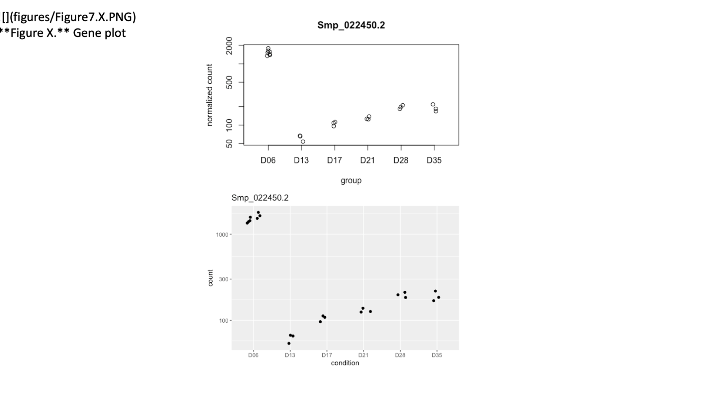
**Figure 13.** Gene plot

**Gene heatmap**
We may want to look at expression profiles of multiple genes at the same time. Heatmaps can be useful for this purpose; it essentially help turn a table of numbers into a mode visual form and it is versatile. The table could be normalised counts of top differentially expressed genes in a given comparison, or it could be genes known to be involved in a specific pathway, or it can be log2FC values instead of read counts. Previously, we use heatmap to visualise matrix of distances between each samples. 

```R
# Select genes with the top-20 lowest adjusted p-value
# Rank genes by their adjusted p-value (padj) 
# order() function returns the position indices of a vector (in this case res$padj) in sorted order, then we use these indices to call data from res dataframe
res_D13D06[order(res_D13D06$padj),]

# Take the top 20 genes from the ranked list
res_D13D06_top20 <- res_D13D06[order(res_D13D06$padj),][1:20,] 

# Take the gene IDs of the top 20 DE genes
res_D13D06_top20_genes <- rownames(res_D13D06_top20)

# Extract the rlog-transformed counts of the top 20 DE genes. 
# By using rlog-transformed counts,extreme values (either low or high) are shrunken and overall differences become clearer, which make the data suitable for visualisation and clustering (producing a heatmap involves clustering of rows and column).
# which() function returns positions where the condition (is TRUE, in this case, the condition is rownames(assay(rld)) %in% res_top20_genes), (translation: rownames of the rld objects match the list of top-20 genes) 
rld_res_D13D06_top20_genes <- assay(rld)[which(rownames(assay(rld)) %in% res_D13D06_top20_genes),]

# Create a heatmap using pheatmap
pheatmap(rld_res_D13D06_top20_genes)
```

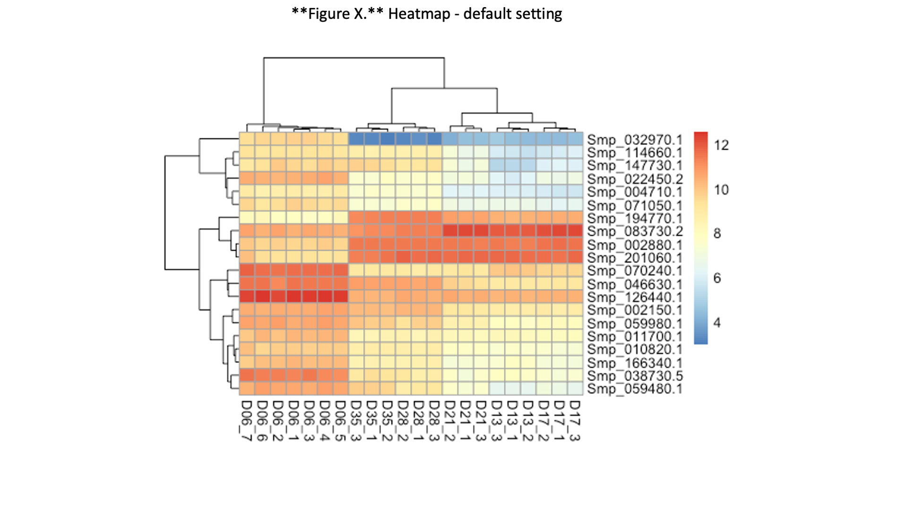
**Figure 14.** Heatmap - default setting

The default plot look quite messy. The rows are annotated with gene IDs, and their writing overlap due to limited space. The column annotations are also long and contain excess information. 

**Customised heatmap**

```R
# Define how columns will be labelled
colann <- c(rep("day-6",7), rep("day-13",3), rep("day-17",3), rep("day-21",3), rep("day-28",3), rep("day-35",3))  

# Create a heatmap
# To see other palette options, run this command display.brewer.all(n=NULL, type="all")
# To see information such as the number of colours, colourblind compatibility, run  brewer.pal.info()
pheatmap(rld_res_D13D06_top20_genes,
color = colorRampPalette(rev(brewer.pal(9, "RdYlBu")))(100),
border_color = NA,
show_rownames = TRUE,
show_colnames = TRUE,
labels_col = colann,
cluster_cols = TRUE,
cellwidth = 15,
fontsize = 10,
main = "Top 20 DE genes: day-13 / day-6")
```

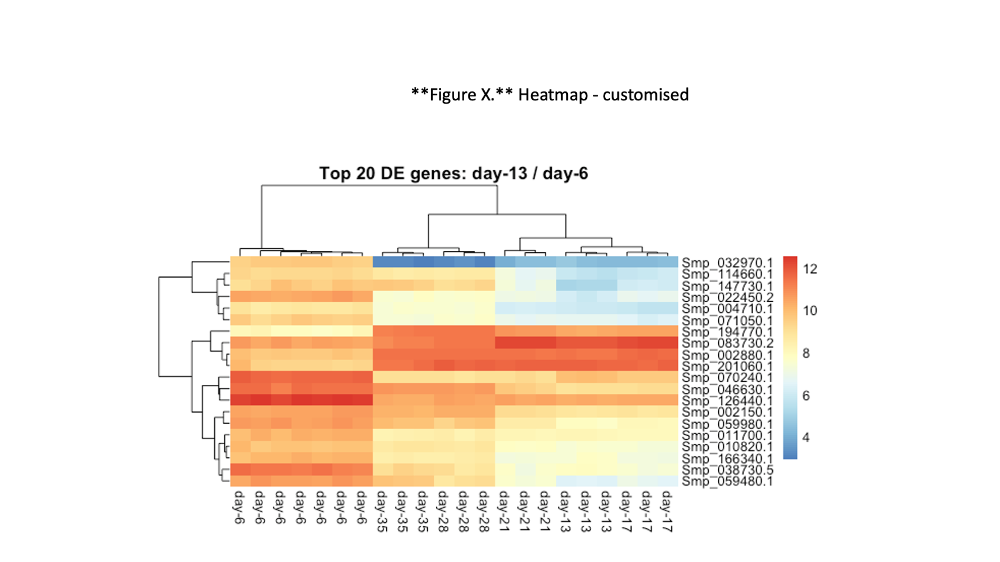
**Figure 15.** Heatmap - customised

---
### Exercise 7.3

1) Compare volcano plot or MA plot of D13vsD06 and D17vsD13 worms. What do you notice about the range of log2FC and adjusted p-values? It might be more informative to show plots from both comparison on the same axis ranges. Try using `ylim()` and `xlim()` argument to set the range of x and y axes. 

2) Select a gene from top differentially expressed genes between D13vsD06 and produce a gene plot. Find out a product name of that gene and add to the title of the gene plot.

---
[↥ **Back to top**](#top)


## Functional analysis using GO term enrichment <a name="go"></a>
Normally when we carry out experiments, we may have some hypotheses about what genes might be differentially expressed between conditions, or what genes might be affected by our treatment. Doing transcriptomics give a huge amount of information so other than going through the list of differentially-expressed gene to find genes that are expected to change, we could let the data guide the way. 

### What to do with your lists of differentially expressed genes?
It can be daunting trying to determine what the results mean. On one hand you may find that there are no real differences in your experiment. Is this due to biological reality or noisy data? On the other hand you may find several thousands of genes are differentially expressed. What can you say about that? One way is to go through a long gene list and investigate each gene one by one, but of course this can be a pain and may be subjected to human bias or our prior knowledge. Instead, we could do functional analysis which is a knowledge-based method incorporating annotated information about potential, or tested, functions of each gene. We may have come across this as GO enrichment analysis, gene set enrichment analysis, pathway enrichment analysis. Today we will show GO enrichment analysis using topGO package in R (Alexa et al., 2005; PMID: 16606683) to determine whether any particular sorts of genes occur more than expected in your differentially expressed genes. Genome downloaded from a database may already come with GO term annotation. For helminth genomes, we can obtain GO term annotation through biomart on WormbaseParasite, or download GFF file direct from WormbaseParasite and extract GO annotation from the GFF file. Otherwise, you could annotate your genes with functional terms from GO using for instance Blast2GO (Conesa et al., 2005; PMID: 16081474). 

### Quick revision on GO term: 
Genes can have associated GO terms (Gene Ontology terms).
GO terms describe features (e.g. functions) of a gene or its encoded product, and can be derived from sequence similarity, experiment, homology etc.
When doing GO term enrichment, essentially we are asking, “Are there any GO terms present in my data more frequently than expected by chance alone?”

### Common tools for GO enrichment analysis
- topGO R package
- goseq R package
- g:Profiler (https://biit.cs.ut.ee/gprofiler/gost)
- GOrilla (http://cbl-gorilla.cs.technion.ac.il/)
- Gene Set Enrichment Analysis (GSEA; https://www.broadinstitute.org/gsea/index.jsp)
- Ingenuity Pathway Analysis Studio (commercial software)

GO enrichment analysis tools on online servers allow researchers to run their analysis with less reliant on command line or coding knowledge. However, available GO annotation reference on the online tools are often limited to model organisms such as human and mouse - except for g:Profiler which has incorporated annotation from multiple genome databases including WormBaseParasite. In other cases, you often need to download the software and run it locally on your computer if you work with non-model organisms. We will learn GO term enrichment on R command line today to familiarise ourselves with the process, but you could also try g:Profiler and other online tools. 

### GO terms enrichment using topGO
Running topGO take a couple of steps (see topGO documentation here https://bioconductor.org/packages/release/bioc/html/topGO.html). We can simplify it using the script provided in run_topGO.R. With this wrapper script, covering all those steps, we can run topGO with one command line. It also adds to the standard topGO output an extra column which list IDs of genes that are responsible for each enriched GO term. 

```R
# Load the R wrapper script for running topGO
source("/<path to data>/Module_7_Transcriptomics/run_topGO.R")

# Collect ID of genes that were up-regulated in D13 (pass cut-off of padj < 0.01 and log2FC > 1)
D13D06_upinD13 <- rownames(res_D13D06)[which(res_D13D06$padj < 0.01 & res_D13D06$log2FoldChange > 1)]

# Check how many genes there are
length(D13D06_upinD13) 

# Run topGO
# The input required for running topGO are: 
# - reference GO annotation (GO terms associated with each gene)
# - list of genes to test for GO enrichment
# - threshold for calling “significant” enrichment
topGO_D13D06_upinD13  <- run_topGO_R(ref = "/<path to data>/Module_7_Transcriptomics/References_v5/Sm_v5_GOref_topGO.txt", genelist = D13D06_upinD13, thres = 0.05)

# Check topGO result. Column 1 to 7 are standard topGO output; column 8 give a list of input genes with that GO term. We won’t look at that at the moment. 
topGO_D13D06_upinD13[,1:7]
```

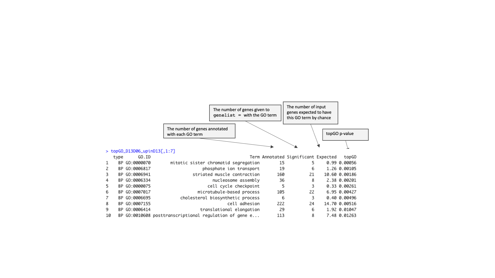  
**Figure 16.** Example of topGO result

---
### Exercise 7.4

1) Run topGO using genes that were up-regulated in day-6 worms, compared to day-13 worms ()

2) What do we notice about differences in day-6 and day-13 worms according to the GO enrichment? 

3) What genes are responsible for the enrichment of the top GO term? Try using WormbaseParasites and other databases to gain more information about those genes and GO term.

---

### Other ways to inspect your RNA-seq data
Now that differential expression analysis and functional analysis on enrichment of associated features are done, what else could we do? Here are some other ways to inspect transcriptome data:
- Some sanity check of your results. Are there anything totally unexpected or surprising? Are the unexpected too far from established biology? Real biological meaning or noise or experimental design confounded?
- Are the gene expression results in-line with observed phenotype/morphology?
- Do different DE tools agree on the result?
- Is there any prior results from other experiments e.g.microarray, qRT-PCR?
- Form hypotheses from your data, go on and test it with different analysis methods of your data (e.g. different tools), or new experiment, or more literature review.

### Making use of existing transcriptome data
Transcriptome experiments are often known to be expensive and not very affordable. Here are some databases of existing transcriptomic data and how some research have made use of them.  

**Databases of transcriptomics data**
- Gene expression omnibus (https://www.ncbi.nlm.nih.gov/geo/)
- ArrayExpress (https://www.ebi.ac.uk/arrayexpress/)
- Expression Atlas (https://www.ebi.ac.uk/gxa/home)

**Example of RNA-seq data reuse:**
- This paper looked at data from published RNA-seq experiments and revealed that some of the cells were contaminated with Mycoplasma (PMID: 25712092).
- This paper used existing RNA-seq data with some new data to study specific gene expression on Z and W chromosome of schistosomes (PMID: 30044216).

### Further resources 
**RNA-seq data analysis guide**
- Hands-on tutorial on RNA-seq data analysis: https://galaxyproject.github.io/training-material/topics/transcriptomics/tutorials/ref-based/tutorial.html  
- News and update on RNA-seq: www.rna-seqblog.com 
- Rather thorough explanation on RNA-seq with lots of details on RNA-seq for differential gene expression: http://chagall.med.cornell.edu/RNASEQcourse/Intro2RNAseq.pdf 
- If you are really interested in statistics behind DE analysis: http://www.nathalievialaneix.eu/doc/pdf/tutorial-rnaseq.pdf 
- If you need a gentle (and step-by-step) guide to a particular statistic technical terms: https://www.youtube.com/user/joshstarmer 

**Databases of your organisms**
- WormbaseParasite (https://parasite.wormbase.org/index.html)
- WormbaseDB (https://wormbase.org/#012-34-5)
- Ensembl (http://asia.ensembl.org/index.html)
- EupathDB (https://eupathdb.org/eupathdb/)
- GenBank (https://www.ncbi.nlm.nih.gov/genome)
- UCSC (http://hgdownload.soe.ucsc.edu/downloads.html)
(GO terms associated with genes are often provide together with genome annotation)

**Databases of pathway and pathway analysis**
- Reactome (https://reactome.org/)
- KEGG (https://www.genome.jp/kegg/)
- InnateDB (http://www.innatedb.com/)
- InterproScan (https://www.ebi.ac.uk/interpro/search/sequence-search)

---
[↥ **Back to top**](#top)


