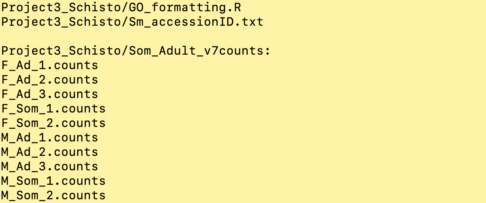
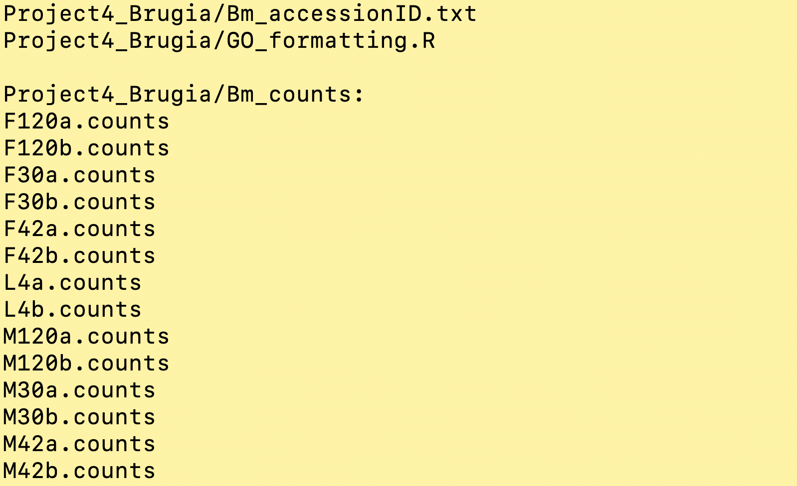
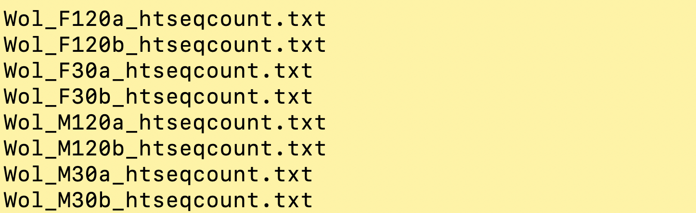
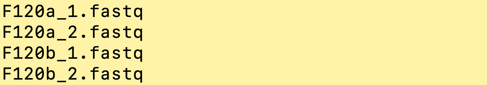

# Project

Congratulation!! You have reached the final day of the course. This is where you will gather the skills you have learnt and practice them on a new problem. Exchange the knowledge, tips and solutions with your coursemates, and ask your instructors if you get stuck.  

The project files that you have downloaded should look like this for [project 3](https://wgcadvancedcourses.github.io/Helminths_2021/manuals/module_4_project_intro/module_4_project_introduction.html#proj3)

`HELM319-material-Project3_Schisto.tar.gz`

And this for [project 4](https://wgcadvancedcourses.github.io/Helminths_2021/manuals/module_4_project_intro/module_4_project_introduction.html#proj4)

`HELM319-material-Project4_Brugia.tar.gz`
`HELM319-material-Project4_Bm_RNAseq_F120.tar.gz`

First, we need to access the content of this file. Notice that it ends with `.tar.gz`
To unzip this kind of file, we do...

```bash
tar -xvf FILENAME
## replace FILENAME with your filename
```

The command we just ran should extract the `.tar.gz` file and produce a directory containing some files.

Check that a directory has been produced
```bash
ls -lrt
```

Have a look inside the directory by doing
```bash
ls DIRECTORYNAME/

# or try this to see the output as shown below
ls -1 DIRECTORYNAME/*
```


**Project 3 file _Project3_Schisto_**


**Project 4 file _Project4_Brugia_**


**Project 4 file _Project4_Wol_**


**Project 4 file _Project4_Bm_RNAseq_F120_**

**Note for project 4:** Don't get scared with the amount of files you have downloaded. The only directory you really need to get started is the **Project4_Brugia**. This directory contain everything you need to look at gene expression in the Brugia worms. The **Project4_Wol** is only needed if you want to do dual-RNA seq and to look at bacteria gene expression as well. The **Project4_Bm_RNAseq_F120** contains down-sized FASTQ files only for those who want to try the genome mapping step. 

You should see the read count files and a text file containing the accession IDs of the original data.
The accession IDs are for the original FASTQ files, and the IDs are there for your reference only. **There is no need to download the FASTQ files for this project session because**

1)	These FASTQ files are HUGE!! To process these files, we normally work on a computer cluster or a high-performance computing server, not on individual laptop

2)	We have already downloaded and processed the FASTQ files for you, up to the point that the data can be analysed on a laptop. These are the read count files you see in your downloaded files. 

## The steps that have already been done for you are
1)	Download the FASTQ files from a public repository (see appendix [Finding and download sequence data from public repository](https://wgcadvancedcourses.github.io/Helminths_2021/manuals/Sequence_data_on_public_repo.html) if you want to learn how to do this)
2)	Download the reference genome and annotation file (GTF) of the worms from WormBaseParaSite (see [WormBaseParaSite module 1](https://wgcadvancedcourses.github.io/Helminths_2021/manuals/module_1_WBP1/module_1_WBP1.html#wbps_genomes))
    Additionally, for project 4, download the reference genome of Wolbachia of _B. malayi_ from [Ensembl Bacteria](http://bacteria.ensembl.org/index.html). The usage is very similar to WormBaseParaSite
3)	Index the reference genome using `hisat2` (see [transcriptomics module](https://wgcadvancedcourses.github.io/Helminths_2021/manuals/module_7_transcriptomics/module_7_transcriptomics.html))
4)	Mapped the FASTQ to the reference genome using `hisat2` (see [transcriptomics module](https://wgcadvancedcourses.github.io/Helminths_2021/manuals/module_7_transcriptomics/module_7_transcriptomics.html))
5)	Convert SAM to BAM using `samtools view` (see [transcriptomics module](https://wgcadvancedcourses.github.io/Helminths_2021/manuals/module_7_transcriptomics/module_7_transcriptomics.html))
6)	Sort BAM files by read names using `samtools sort` (see [transcriptomics module](https://wgcadvancedcourses.github.io/Helminths_2021/manuals/module_7_transcriptomics/module_7_transcriptomics.html))
7)	Count reads per features (in this case, reads per gene) using `htseq-count` (see [transcriptomics module](https://wgcadvancedcourses.github.io/Helminths_2021/manuals/module_7_transcriptomics/module_7_transcriptomics.html))

## The steps that you will perform by yourself in this project are (most of them refer to the [transcriptomics module](https://wgcadvancedcourses.github.io/Helminths_2021/manuals/module_7_transcriptomics/module_7_transcriptomics.html))
1)	Starting in RStudio
2)	Import the read counts data into RStudio
3)	Explore the data using various data visualisation
4)	Perform pair-wise comparison of any comparisons that you are interested in and produce relevant plots
5)	Look at your results, compare your results, follow the lead of your results, explore genes using public databases e.g. WormBaseParaSite, InterProScan etc. 
6)	Perform functional analysis using GO term enrichment

### GO enrichment tips!!!! 
Notice that we have provided a _GO term annotation reference_ for you in the [transcriptomics module](https://wgcadvancedcourses.github.io/Helminths_2021/manuals/module_7_transcriptomics/module_7_transcriptomics.html), but not in this project module. You cannot use the same GO annotation reference here because...

1) For project 3, the FASTQ were mapped to a different version of S. mansoni genome (a newer and current version for this project module). There are some changes in gene IDs between the genome versions, and using the GO annotation file from a previous version may result in errors or incomplete results.

2) For project 4, we are using a completely different organism here. Therefore, we need a new GO annotation for this one. 

You will need to download a new GO annotation by yourself using WormBaseParaSite BioMart. 🤓

- See appendix [Downloading and formatting GO annotation](https://wgcadvancedcourses.github.io/Helminths_2021/manuals/GO_ref_download_and_formatting.html) on how to do this
- You are also provided with the R script `GO_formatting.R` to reformat the downloaded GO reference into the format the `topGO` require. **However, this is not a complete-and-ready-to-use script**, and it will need some editing _(a real life scenario when you borrow script from someone else)_ 
- Have a look through the script `GO_formatting.R` and try to figure out which parts need to be edited. A simple way to do this would be to copy the whole code from `GO_formatting.R` and place it into your current R script and test your editing there. 


